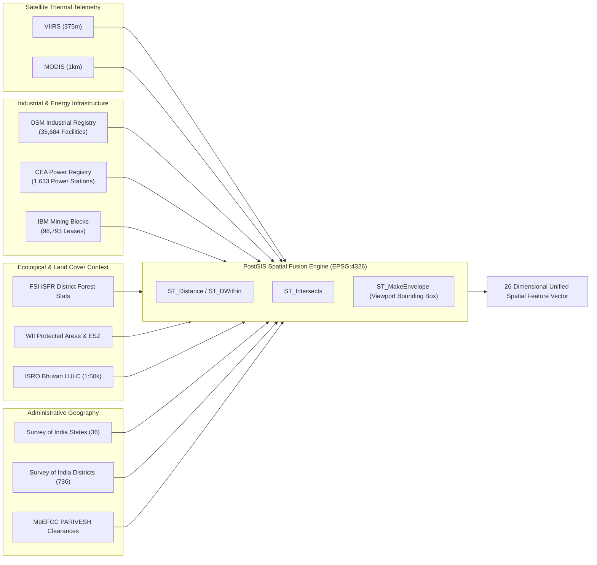
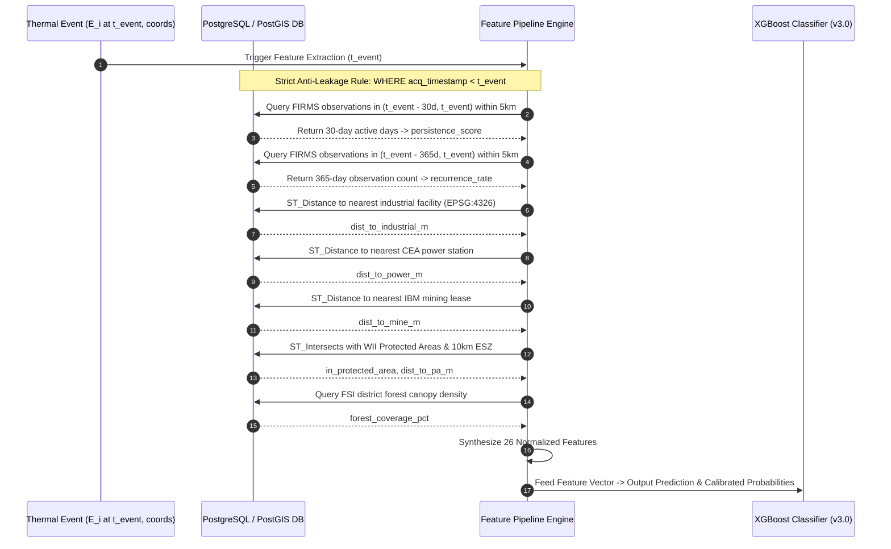
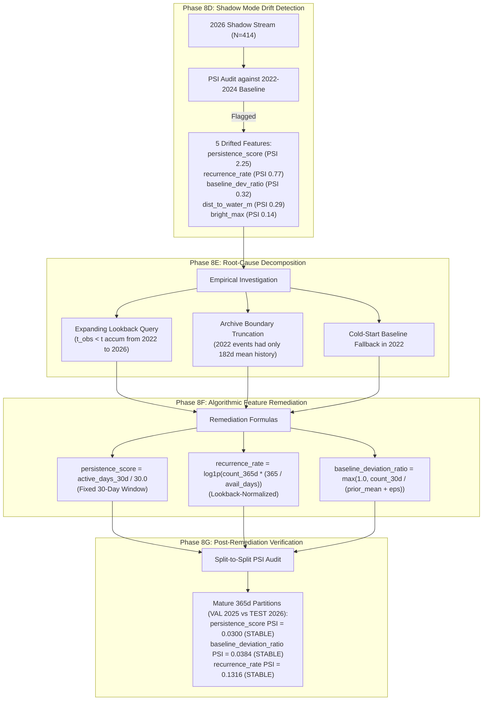
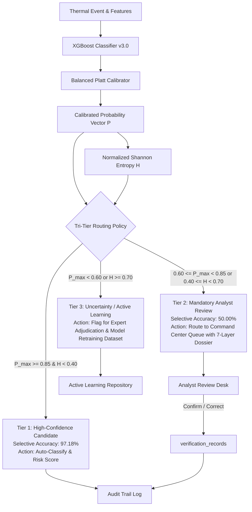
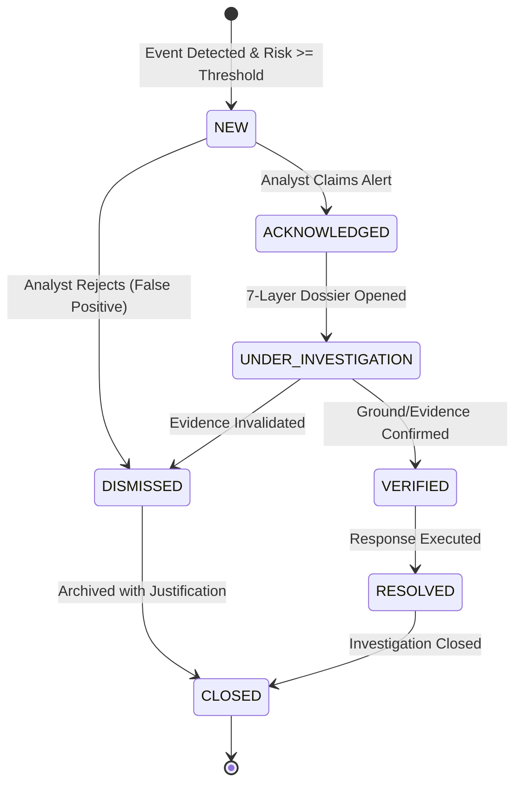
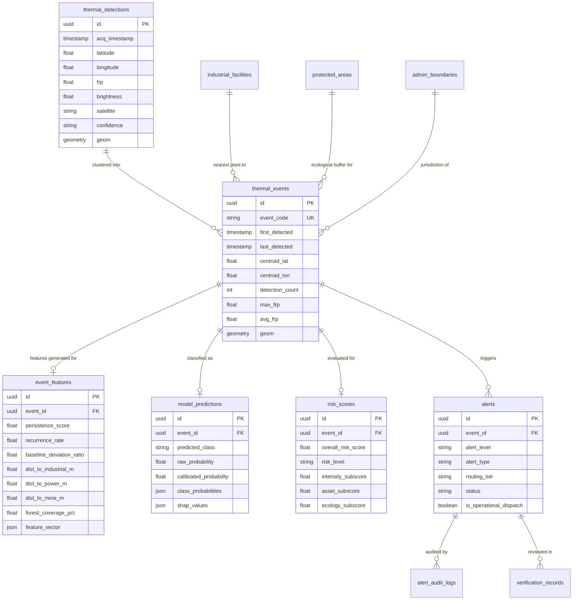
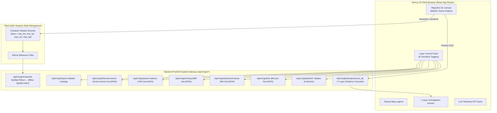

# AGNI-NETRA: System Architecture & Engineering Diagrams

This document provides complete, high-resolution architectural diagrams illustrating the end-to-end engineering, geospatial fusion, machine learning, and operational workflow of the **AGNI-NETRA** platform.

---

## 1. Overall System Architecture

```mermaid
graph TB
    subgraph SATELLITE_INGESTION["Layer 1: Satellite Telemetry Ingestion"]
        FIRMS["NASA FIRMS API<br/>(VIIRS SNPP, NOAA-20/21, MODIS Aqua/Terra)"]
        INGEST["Ingestion Worker<br/>(Deduplication, BBox Validation, Integrity Checks)"]
        FIRMS --> INGEST
    end

    subgraph DATABASE_LAYER["Layer 2: PostGIS Database & Knowledge Base (EPSG:4326)"]
        DB_THERMAL[("thermal_detections<br/>(8.2M+ rows, Partitioned)")]
        DB_EVENTS[("thermal_events<br/>(DBSCAN Clustered)")]
        DB_FAC[("industrial_facilities<br/>(35,684 records)")]
        DB_POWER[("cea_power_stations<br/>(1,633 records)")]
        DB_MINE[("ibm_mining_leases<br/>(98,793 records)")]
        DB_FOREST[("fsi_isfr_forest_stats<br/>& protected_areas")]
        DB_LULC[("lulc_spatial_features<br/>(ISRO Bhuvan)")]
        DB_ADMIN[("admin_boundaries<br/>(36 States, 736 Districts)")]
        
        INGEST --> DB_THERMAL
        DB_THERMAL --> DB_EVENTS
    end

    subgraph SPATIAL_ENRICHMENT["Layer 3: PostGIS Spatial Intelligence & Feature Engineering"]
        DBSCAN["Incremental Spatiotemporal Clustering<br/>(DBSCAN: eps=0.015°, min_samples=3)"]
        POINT_IN_TIME["Point-in-Time Anti-Leakage Feature Engine<br/>(t_obs < t_event; 30d/365d Lookbacks)"]
        PROXIMITY["PostGIS Geodesic Proximity Engine<br/>(ST_Distance, ST_DWithin, ST_Intersects)"]
        
        DB_EVENTS --> DBSCAN
        DBSCAN --> POINT_IN_TIME
        DB_FAC & DB_POWER & DB_MINE & DB_FOREST & DB_LULC & DB_ADMIN --> PROXIMITY
        PROXIMITY --> POINT_IN_TIME
    end

    subgraph ML_INFERENCE["Layer 4: Machine Learning & Risk Intelligence"]
        XGB["XGBoost Multi-Class Classifier<br/>(v3.0-real-candidate, 26 Features)"]
        CALIB["Balanced Platt Calibrator<br/>(Log-Loss: 0.7124, ECE: 0.1294)"]
        SHAP_EXP["TreeExplainer SHAP Engine<br/>(Local Feature Attribution)"]
        RISK_ENG["Multi-Factor Risk Engine<br/>(Intensity 40% + Asset 35% + Ecology 25%)"]
        
        POINT_IN_TIME --> XGB
        XGB --> CALIB
        CALIB --> SHAP_EXP
        CALIB --> RISK_ENG
        SHAP_EXP --> RISK_ENG
    end

    subgraph HITL_DECISION["Layer 5: Human-in-the-Loop Tri-Tier Decision Support"]
        ROUTER{"Tri-Tier Routing Engine"}
        T1["Tier 1: High-Confidence Autonomous<br/>(Conf >= 0.85, 97.18% Selective Acc)"]
        T2["Tier 2: Analyst Review Queue<br/>(0.60 <= Conf < 0.85, 7-Layer Dossier)"]
        T3["Tier 3: Uncertainty / Active Learning<br/>(Conf < 0.60 or High Entropy)"]
        
        RISK_ENG --> ROUTER
        ROUTER -->|Conf >= 0.85| T1
        ROUTER -->|0.60 <= Conf < 0.85| T2
        ROUTER -->|Conf < 0.60| T3
    end

    subgraph DISPATCH_SAFETY["Layer 6: Operational Safety & Governance Gate"]
        GATE{"ENABLE_OPERATIONAL_DISPATCH_GATE<br/>(Enforced FALSE)"}
        DISPATCH_INACTIVE["DISPATCH INACTIVE<br/>(Alerts queued for Analyst Review)"]
        DISPATCH_ACTIVE["AUTHORIZED ACTIVATION<br/>(Future Agency Dispatch)"]
        
        T1 & T2 & T3 --> GATE
        GATE -->|False (Current)| DISPATCH_INACTIVE
        GATE -->|True (Controlled)| DISPATCH_ACTIVE
    end

    subgraph COMMAND_CENTER["Layer 7: National Command Center & GIS Frontend"]
        NEXTJS["Next.js 15 App Router & API Gateway"]
        MAPLIBRE["MapLibre GL JS 8-Layer Vector Canvas<br/>(Viewport Bounding Box Querying)"]
        DOSSIER_VIEW["7-Layer Investigation Dossier UI"]
        ALERTS_DESK["Tri-Tier Alert Triage Desk"]
        
        DISPATCH_INACTIVE --> NEXTJS
        NEXTJS --> MAPLIBRE
        NEXTJS --> DOSSIER_VIEW
        NEXTJS --> ALERTS_DESK
    end
```

---

## 2. Multi-Source Geospatial Intelligence Architecture



---

## 3. Point-in-Time Anti-Leakage Feature Pipeline



---

## 4. Shadow Drift Investigation & Feature Remediation Pipeline



---

## 5. Tri-Tier Human-in-the-Loop Decision Architecture



---

## 6. Alert Lifecycle & State Transition Model



---

## 7. PostgreSQL / PostGIS Relational Schema



---

## 8. Frontend GIS Architecture & Dynamic Viewport Querying


