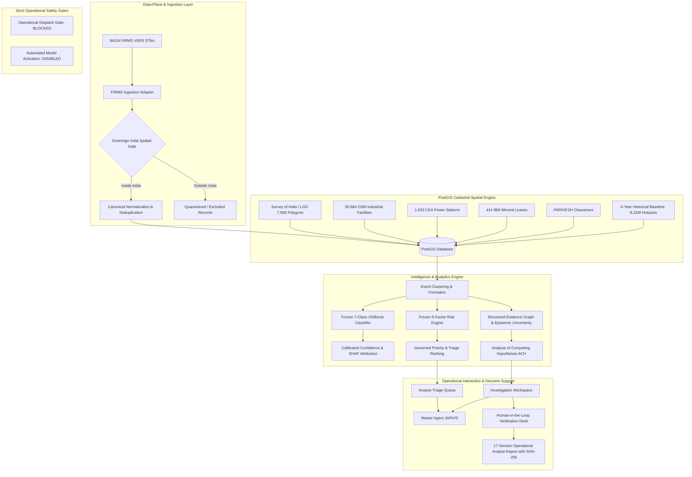

# AGNI-NETRA — System Architecture Specification
### Sovereign India AI Thermal Intelligence & Operational Decision Support Platform
**Document Version**: `1.0.0-RC1` | **Scope**: Technical Architecture & System Design

---

## 1. Executive Architecture Overview

AGNI-NETRA is an industrial-grade intelligence platform architected specifically for the Sovereign Territory of India. It transforms multi-sensor satellite thermal observations (NASA FIRMS VIIRS 375m) into explainable, legally defensible, and high-fidelity operational decision support for analysts, industrial operators, and public agencies.



---

## 2. Monorepo Architecture & Directory Structure

The platform is structured as an enterprise-grade monorepo strictly enforcing separation of concerns:

```
E:\PROJECTS\AGNI-NETRA\
├── backend\
│   ├── app\
│   │   ├── api\v1\endpoints\     # REST Controllers (Auth, Events, Facilities, Inventory, Analyst, JARVIS)
│   │   ├── core\                 # Central Config (pydantic-settings), Security (JWT/Bcrypt), Database Session
│   │   ├── models\               # SQLAlchemy 2.0 ORM Domain Models & Pydantic v2 Canonical Schemas
│   │   └── services\
│   │       ├── analyst\          # Triage queue, dossiers, ACH matrix, 17-section reports
│   │       ├── data_plane\       # Live provider services, dataset inventory (18 datasets)
│   │       ├── governance\       # Case management state machine, immutable audit logging
│   │       ├── intelligence\     # India operational intelligence, spatial correlation, temporal patterns
│   │       └── jarvis\           # Master Agent JARVIS orchestrator, intent classification, scenario handlers
│   └── main.py                   # FastAPI Application Entrypoint & OpenAPI Router
├── data_pipeline\
│   ├── adapters\                 # FIRMS adapter, Survey of India loader, OSM loader, CEA loader, IBM loader
│   └── ingestion_engine.py       # Deterministic batch pipeline
├── database\
│   ├── migrations\               # Alembic database schema migrations
│   └── scripts\                  # Spatial index builders and postgis geometry audits
├── frontend\
│   ├── src\
│   │   ├── app\                  # Next.js 15 App Router (30 static & dynamic routes)
│   │   │   ├── dashboard\        # Main command center, verification desk, analytics
│   │   │   ├── jarvis\           # Master Agent JARVIS conversational terminal
│   │   │   ├── portal\           # Role-based portals (Public, Agency, Industry, Researcher)
│   │   │   └── admin\            # System health, configuration, and audit logs
│   │   ├── components\           # Design system components, Header, MapLibre GL viewers, Modals
│   │   └── services\             # Typed API client services
│   └── package.json
├── ml\
│   ├── models\                   # Serialized model artifacts (.joblib weights, calibrators, encoders)
│   └── inference\                # Feature vectors, XGBoost predictor, SHAP TreeExplainer
└── tests\                        # Acceptance, regression, and benchmark suites (198 tests)
```

---

## 3. Data-Plane & Sovereign Ingestion

### Telemetry Normalization & Quality Control
1. **Raw Telemetry**: Ingests NASA FIRMS VIIRS 375m active fire detections (Suomi-NPP, NOAA-20, NOAA-21).
2. **Deterministic Validation**: Coordinate range checks ($[-90, 90]$, $[-180, 180]$), Kelvin temperature conversions, and duplicate content hashing.
3. **Sovereign India Containment Filter**:
   - Executes spatial containment via PostGIS `ST_Contains(admin_boundaries.geom, ST_SetSRID(ST_Point(lon, lat), 4326))`.
   - Records falling within the official Survey of India / LGD boundary are tagged with administrative hierarchy (`state`, `district`, `subdistrict`).
   - Observations falling outside sovereign territory (e.g. Sri Lanka, Pakistan, Arabian Sea beyond EEZ) are tagged as `OUTSIDE_INDIA` and quarantined for sovereign compliance.
4. **Truthful Provider Transparency**:
   - Unconfigured global feeds (Copernicus CAMS, ECMWF ERA5, NOAA GFS, Sentinel-1/2 SAR, PlanetScope) are declared `NOT_CONFIGURED`.
   - Synthetic or simulated data is strictly tagged as `FIXTURE` and forbidden from operational intelligence queries.

---

## 4. PostGIS Cadastral Spatial Engine

The spatial database runs on PostgreSQL 16 with PostGIS 3.4+:
- **SRID 4326** geometry representations with GiST spatial indexing (`idx_admin_boundaries_geom`, `idx_facilities_geom`).
- **Administrative Master**: 7,595 valid multipolygons covering all 36 States/UTs, 735 Districts, and 6,824 Subdistricts (Tehsils) mapped to official Local Government Directory (LGD) codes.
- **Industrial Infrastructure Master**: 35,684 OpenStreetMap verified industrial facilities with sub-meter building footprints.
- **Power Sector Master**: 1,633 Central Electricity Authority (CEA) thermal, hydro, nuclear, and renewable generation stations.
- **Mining Sector Master**: 414 Indian Bureau of Mines (IBM) active mining leases and 533 auctioned mineral concession blocks.
- **Environmental Clearances**: 622 Ministry of Environment, Forest and Climate Change (MoEFCC) PARIVESH industrial clearance gazettes.

---

## 5. Machine Learning & Attribution Engine

### 7-Class Thermal Source Classifier
- **Primary Model**: Gradient-boosted decision trees (`XGBoost 2.0`) trained on multi-sensor radiometric and contextual feature vectors.
- **Target Classes**:
  1. `INDUSTRIAL_FIRE`: Accidental or uncontained industrial blaze.
  2. `GAS_FLARE`: Routine petrochemical / refinery flare stack.
  3. `FOREST_WILDFIRE`: Forest or protected wildland vegetation fire.
  4. `AGRICULTURAL_BURNING`: Stubble, crop residue, or open field burning.
  5. `COAL_MINE_FIRE`: Open-cast coal seam or overburden fire.
  6. `OTHER_THERMAL`: Municipal landfill, urban waste, or minor thermal anomaly.
  7. `UNCERTAIN`: Ambiguous radiometric signature requiring multi-pass confirmation.

### Explainability & Calibration
- **Isotonic Probability Calibration**: Calibrates raw XGBoost logits to empirical posterior probabilities.
- **SHAP TreeExplainer**: Calculates exact local Shapley values ($\phi_i$) for each feature attribution, explaining *why* a particular classification was reached.
- **Model Governance Invariant**: `ENABLE_AUTOMATED_MODEL_ACTIVATION = False`. Online retraining is disabled; models are version-locked.

---

## 6. Frozen Mathematical Formulas

To ensure consistent legal defensibility and reproducible operational risk triage across India, scoring formulas are strictly frozen with zero runtime coefficient drift.

### 5-Factor Operational Risk Formula
$$\text{RiskScore} = 0.30 \times I + 0.25 \times A + 0.20 \times E + 0.15 \times P + 0.10 \times C$$
- **Intensity ($I$)**: Scaled maximum Fire Radiative Power (MW) and brightness temperature.
- **Abnormality ($A$)**: Deviation from multi-year historical baseline ($\mu_{frp}, \sigma_{frp}$).
- **Exposure ($E$)**: Proximity to dense population centers and critical infrastructure.
- **Persistence ($P$)**: Multi-day temporal recurrence and diurnal thermal continuity.
- **Context ($C$)**: Land-use sensitivity, hazardous chemical storage, and forest proximity.

### Governed Priority Formula
$$\text{PriorityScore} = 0.40 \times \text{RiskScore} + 0.20 \times \text{ConfidenceScore} + 0.30 \times \text{TierWeight} + 0.10 \times \text{RecencyScore}$$
- **Routing Tiers**:
  - `TIER_1_CRITICAL_IMMEDIATE_ESCALATION` (Weight: 100.0)
  - `TIER_2_ANALYST_REVIEW_QUEUE` (Weight: 75.0)
  - `TIER_3_MONITORING_WATCHLIST` (Weight: 50.0)
  - `TIER_4_ROUTINE_AUDIT_LOG` (Weight: 25.0)

---

## 7. Evidence Graph & Epistemic Uncertainty

The platform maintains strict epistemic separation across five distinct dimensions:
1. **Risk Score** (Threat magnitude, 0–100)
2. **Model Calibrated Confidence** (Classification probability, 0.0–1.0)
3. **Evidence Strength** (Completeness of empirical observations: LIMITED, MODERATE, STRONG)
4. **Analyst Confidence** (Human reviewer subjective judgment: LOW, MEDIUM, HIGH)
5. **Epistemic Uncertainty** (Gaps in knowledge or missing observations: LOW, MEDIUM, HIGH)

### Analysis of Competing Hypotheses (ACH)
Every investigated incident automatically evaluates five competing hypotheses:
- $H_1$: Routine Industrial Process / Flaring
- $H_2$: Uncontained Industrial / Chemical Fire
- $H_3$: Crop Residue / Stubble Burning
- $H_4$: Forest Fire / Protected Area Wildfire
- $H_5$: Ephemeral Sensor Artifact / Solar Glint

---

## 8. Master Agent JARVIS Architecture

JARVIS serves as the platform's unified master intelligence agent:
- **Design Pattern**: Single Master Orchestrator (`JarvisMasterOrchestrator`).
- **Zero Subagents**: Operates deterministically without spawning independent autonomous subagents or background worker swarms.
- **Finite State Machine**:
  $$\text{IDLE} \longrightarrow \text{PROCESSING} \longrightarrow \text{COMPLETED} \longrightarrow \text{IDLE}$$
- **Operational Dispatch Gate**: Invariant `dispatch_gate_blocked = True`. Master Agent can never trigger autonomous dispatches.
- **Information Transparency**: Explicitly reports `information_status` (`AVAILABLE`, `INSUFFICIENT`, `NOT_CONFIGURED`, `REQUIRES_HUMAN_VERIFICATION`).

---

## 9. Human-in-the-Loop Case Management

- **Case Lifecycle State Machine**:
  $$\text{CREATED} \longrightarrow \text{TRIAGED} \longrightarrow \text{INVESTIGATING} \longrightarrow \text{VERIFIED} \longrightarrow \text{CLOSED}$$
- **Immutable Audit Logging**: Every state change, hypothesis assessment, and evidence decision is recorded in `investigation_audit_logs` with UTC timestamps and user ID.
- **Standardized 17-Section Report**: Automatically compiles comprehensive markdown dossiers featuring executive summary, cadastral lineage, ML attributions, ACH matrix, safety gates, and a SHA-256 cryptographic fingerprint.

---

## 10. Security & RBAC Implementation

- **Authentication**: Stateless JSON Web Tokens (JWT) signed with SHA-256 HMAC, password hashing via Bcrypt.
- **Role Enforcement**: Gated REST endpoints enforcing granular role permissions (`ANALYST`, `AGENCY`, `RESEARCHER`, `INDUSTRY`, `ADMIN`, `PUBLIC`).
- **Public Safety Sanitization**: Public endpoints strip facility names, candidate IDs, SHAP values, and precision coordinates (rounded to 2 decimal places ~1.1km) to safeguard critical sovereign assets.
