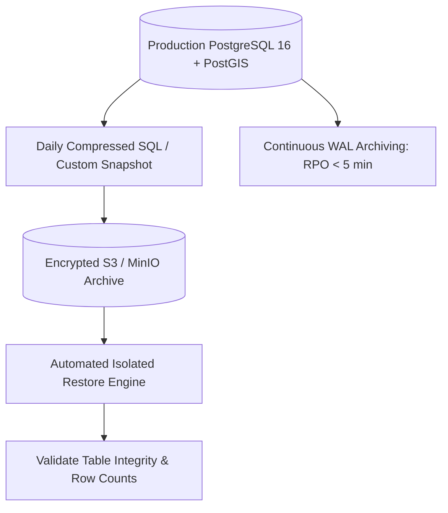

# AGNI-NETRA — POSTGRESQL & POSTGIS DATABASE RECOVERY RUNBOOK

**Document ID**: DBA-AGNI-REC-001  
**Target Audience**: Database Administrators, SREs, Disaster Recovery Engineers  
**Classification**: Government Operations / Restricted  
**Effective Date**: 2026-09-02  

---

## 1. Disaster Recovery Objectives & Backup Strategy



### Key Continuity Metrics
- **Recovery Point Objective (RPO)**: $< 5$ minutes (Achieved via Continuous WAL archiving).
- **Recovery Time Objective (RTO)**: $< 30$ minutes for full 8.22M+ detection database restore.
- **Authoritative Historical Partition Policy**: Historical partitions (2022–2025: 6,448,666 rows) are strictly immutable and sealed with read-only table permissions.

---

## 2. Backup Verification & Lifecycle Schedule

| Backup Type | Frequency | Retention Period | Storage Location | Automated Verification |
|---|---|---|---|---|
| **Full Database Snapshot** | Daily at 01:00 IST | 90 Days | `s3://agni-netra-backups/daily/` | Tested daily via isolated restore engine |
| **WAL Segments** | Continuous (every 16 MB) | 14 Days | `s3://agni-netra-backups/wal/` | Archive status polled every 10 min |
| **Schema & Partition Exports** | Weekly (Sundays) | 365 Days | `s3://agni-netra-backups/schema/` | Git tracked & signed |

---

## 3. Automated Backup Creation Procedure

To manually trigger a production backup archive:
```powershell
python -c "
from backend.app.core.database import SessionLocal
from database.backup_recovery_service import backup_recovery_service

db = SessionLocal()
try:
    bak = backup_recovery_service.create_database_backup(db)
    print('Backup Created Successfully:')
    print('ID:', bak['backup_id'])
    print('File:', bak['backup_file'])
    print('Size:', f\"{bak['file_size_bytes']:,} bytes\")
finally:
    db.close()
"
```

---

## 4. Isolated Restore Verification (Non-Destructive)

Before performing any production restore, verify the backup archive integrity in an isolated test database to guarantee the primary database remains untouched:

```powershell
python -c "
from database.backup_recovery_service import backup_recovery_service
# Provide path to the latest backup archive
res = backup_recovery_service.verify_isolated_restore()
print('Restore Verification Status:', res['status'])
print('Primary Database Isolated:', res['production_db_isolation_preserved'])
assert res['production_db_isolation_preserved'] is True
"
```

---

## 5. Full Cold Disaster Recovery Procedure

In the event of hardware failure, catastrophic volume loss, or corrupted storage, execute the following emergency restoration:

### Step 1: Provision Clean PostgreSQL 16 Instance
```bash
# Initialize clean cluster with UTF-8 encoding
initdb -D /var/lib/postgresql/16/data -E UTF8 --locale=C
```

### Step 2: Enable PostGIS & Spatial Extensions
```sql
CREATE DATABASE agni_netra;
\c agni_netra;
CREATE EXTENSION IF NOT EXISTS postgis;
CREATE EXTENSION IF NOT EXISTS postgis_topology;
```

### Step 3: Restore Database Dump
```bash
# Restore compressed backup using parallel pg_restore
pg_restore -U postgres -d agni_netra -j 4 --clean --if-exists /path/to/backup_archive.dump
```

### Step 4: Verify Historical Immutability & Sealed Record Counts
```sql
SELECT 
    COUNT(*) FILTER (WHERE acq_timestamp >= '2022-01-01' AND acq_timestamp < '2023-01-01' AND is_demo = false) as c_2022_off,
    COUNT(*) FILTER (WHERE acq_timestamp >= '2022-01-01' AND acq_timestamp < '2023-01-01' AND is_demo = true) as c_2022_pil,
    COUNT(*) FILTER (WHERE acq_timestamp >= '2023-01-01' AND acq_timestamp < '2024-01-01' AND is_demo = false) as c_2023_off,
    COUNT(*) FILTER (WHERE acq_timestamp >= '2024-01-01' AND acq_timestamp < '2025-01-01') as c_2024_rec,
    COUNT(*) FILTER (WHERE acq_timestamp >= '2025-01-01' AND acq_timestamp < '2026-01-01') as c_2025_off,
    COUNT(*) FILTER (WHERE acq_timestamp >= '2026-01-01') as c_2026_off
FROM thermal_detections;

-- Required Target Counts:
-- 2022 Official: 1,274,383
-- 2022 Pilot:    210,000
-- 2023 Official: 1,244,759
-- 2024 Reconciled: 1,711,626
-- 2025 Ground:   2,007,898
-- Historical Sealed Sum: 6,448,666
-- 2026 Operational: >= 1,771,080
```

### Step 5: Rebuild Spatial & Operational Indexes
```sql
-- Rebuild GiST spatial index on geometries
REINDEX INDEX idx_detections_geom_gist;
REINDEX INDEX idx_events_geom_gist;
REINDEX INDEX idx_facilities_geom_gist;

-- Update optimizer statistics
ANALYZE VERBOSE;
```

---

## 6. Point-in-Time Recovery (PITR) Protocol

To recover to a precise timestamp prior to an accidental operational corruption:

1. **Stop Application Services**:
   ```powershell
   taskkill /IM uvicorn.exe /T /F
   ```
2. **Configure `recovery.signal` & `postgresql.conf`**:
   ```ini
   restore_command = 'cp /var/lib/postgresql/wal_archive/%f %p'
   recovery_target_time = '2026-09-02 11:30:00+05:30'
   recovery_target_action = 'promote'
   ```
3. **Start PostgreSQL in Recovery Mode**:
   ```bash
   pg_ctl -D /var/lib/postgresql/16/data start
   ```
4. **Inspect Recovery Logs**:
   - Monitor `postgresql.log` until `consistent recovery state reached` and promotion completes.
5. **Resume Application Traffic & Verify Readiness**:
   ```bash
   curl http://localhost:8000/api/v1/health/readiness
   ```
