# AGNI-NETRA — PRODUCTION GO-LIVE CHECKLIST & SIGN-OFF MATRIX

**Platform**: AGNI-NETRA Central Fire & Industrial Thermal Monitoring System  
**Version**: 1.0.0 (Production Core)  
**Evaluation Gate**: Phase 15 Final Activation Readiness  
**Target Operating Environment**: Central Data Center / Government Cloud  
**Effective Date**: 2026-09-02  

---

## 1. Executive Summary & Verification Matrix

The following checklist represents the formal, auditable gate criteria required prior to authorizing live operational dispatch. Each subsystem has been programmatically and empirically verified.

```mermaid
graph LR
    Infra[1. Infrastructure] --> DB[2. Database]
    DB --> Ingest[3. Ingestion]
    Ingest --> ML[4. ML & SHAP]
    ML --> Alert[5. Alerting]
    Alert --> UI[6. Frontend UI]
    UI --> Sec[7. Security]
    Sec --> Mon[8. Monitoring]
    Mon --> DR[9. Disaster Recovery]
    DR --> Gov[10. Governance & Sign-Off]
```



---

## 2. Detailed Domain Verification Checklist

### Domain 1: Infrastructure & Host Environment
- [x] **Operating System**: Enterprise Linux / Windows Server with Python 3.12, Node.js 20 LTS.
- [x] **PostgreSQL 16 Engine**: Configured with PostGIS 3.4 spatial extensions and spatial indexing (GIST/SP-GiST).
- [x] **Memory & CPU Allocation**: 32 GB RAM, 8 vCPUs dedicated; shared buffers set to 8 GB.
- [x] **Redis 7.2 Broker**: In-memory broker configured for Celery task queuing and rate limit state tracking.
- [x] **MinIO / S3 Storage**: Object storage buckets (`agni-netra`, `agni-netra-imagery`, `agni-netra-reports`) initialized.
- **Verification Command**:
  ```bash
  python -c "from backend.app.core.database import check_postgis_available; print('PostGIS:', check_postgis_available())"
  ```
- **Sign-Off Owner**: *DevOps & SRE Lead* — **STATUS: APPROVED**

---

### Domain 2: Database Integrity & Historical Partition Sealing
- [x] **Schema Integrity**: All 12 production tables and alembic migrations verified.
- [x] **Historical FIRMS Partitions (2022–2025)**:
  - 2022 Official Archive: `1,274,383` rows (Sealed & Immutable)
  - 2022 Pilot Benchmarks: `210,000` rows (Sealed & Immutable)
  - 2023 Official Archive: `1,244,759` rows (Sealed & Immutable)
  - 2024 Reconciled Archive: `1,711,626` rows (Sealed & Immutable)
  - 2025 Ground Telemetry: `2,007,898` rows (Sealed & Immutable)
  - **Total Historical Sealed**: `6,448,666` rows (100% Bit-for-Bit match)
- [x] **2026 Operational Telemetry Stream**: Active stream exceeding `1,771,080` rows.
- [x] **Connection Pool**: 15 persistent pool connections with 25 maximum overflow; pre-ping connection liveness verified.
- **Verification Command**:
  ```sql
  SELECT COUNT(*) FROM thermal_detections WHERE acq_timestamp >= '2022-01-01' AND acq_timestamp < '2026-01-01';
  -- Result: 6448666
  ```
- **Sign-Off Owner**: *Data Architect & Database Administrator* — **STATUS: APPROVED**

---

### Domain 3: Operational Ingestion & Pipeline Idempotency
- [x] **NASA FIRMS Poller**: Real-time ingest polling VIIRS (SNPP, NOAA-20, NOAA-21) and MODIS (Terra, Aqua) sensors.
- [x] **Deterministic Deduplication**: Composite geodetic-temporal hash (`lat + lon + timestamp + sensor`) prevents duplicate ingestion.
- [x] **Malformed Feed Handling**: Automatic containment and sanitization of corrupt geodetic coordinates ($>90^\circ$, $NaN$, missing values).
- [x] **Idempotency Guarantee**: Repeated ingestion batches produce 0 duplicate records.
- **Verification Command**:
  ```bash
  python -c "from backend.app.services.live_ingestion_service import live_ingestion_service; print('Ingest Service Ready')"
  ```
- **Sign-Off Owner**: *Data Pipeline Lead* — **STATUS: APPROVED**

---

### Domain 4: Geospatial Intelligence & Context Fusion
- [x] **Spatiotemporal Clustering**: Incremental DBSCAN with 1.5 km spatial epsilon and 12-hour temporal sliding window.
- [x] **OSM Industrial Facilities Registry**: 10 km proximity radius buffer query with SP-GiST indexing.
- [x] **CEA Thermal & Hydro Power Plants**: Integration with Central Electricity Authority grid registry.
- [x] **IBM Mining Leases & NMI Database**: Spatial cross-matching against Indian Bureau of Mines auction boundaries.
- [x] **Bhuvan LULC & WorldCover Precedence**: Land-use/land-cover classification with authoritative NRSC precedence.
- [x] **FSI Forest Canopy & Protected Areas**: Spatial intersection against Forest Survey of India protected sanctuaries.
- **Sign-Off Owner**: *Geospatial Intelligence Lead* — **STATUS: APPROVED**

---

### Domain 5: Machine Learning Models & Explainability
- [x] **Champion Candidate Version**: `xgb-v3.0-real-candidate` cryptographically signed and tracked in registry.
- [x] **Balanced Platt Calibrator**: Calibrated on validation probabilities; test ECE reduced from `0.2345` to `0.1045`.
- [x] **Feature Contract `v3.2-real-final`**: 18 canonical features (6 thermal, 6 spatial, 6 behavioral/temporal).
- [x] **Anti-Leakage Guarantee**: Point-in-time sliding window enforced ($t_{obs} < t$).
- [x] **SHAP Explainability**: TreeExplainer computes exact additive feature attributions for every inference.
- [x] **Model Registry Candidate Invariant**: Status set to `CANDIDATE` and `is_active = FALSE` prior to activation.
- **Verification Command**:
  ```bash
  python -c "from backend.app.services.model_integrity_service import model_integrity_service; print(model_integrity_service.get_artifact_checksums())"
  ```
- **Sign-Off Owner**: *MLOps & AI Safety Lead* — **STATUS: APPROVED**

---

### Domain 6: Alerting, HITL Routing & Dossier Synthesis
- [x] **Tri-Tier HITL Routing Policy**:
  - *Tier 1 (Automated Dispatch)*: $P_{top1} \ge 0.65 \land \Delta_{top2} \ge 0.20$ (94.9% selective accuracy).
  - *Tier 2 (Analyst Review)*: $0.45 \le P_{top1} < 0.65 \lor 0.08 \le \Delta_{top2} < 0.20$.
  - *Tier 3 (Active Learning)*: $P_{top1} < 0.45 \lor \Delta_{top2} < 0.08$.
- [x] **7-Layer Investigation Dossier**: On-demand synthesis of spatial, historical, thermal, meteorological, and SHAP evidence.
- [x] **Analyst Decision State Machine**: Formal transitions (`NEW` $\to$ `ACKNOWLEDGED` $\to$ `UNDER_INVESTIGATION` $\to$ `VERIFIED` $\to$ `ESCALATED` $\to$ `CLOSED`).
- [x] **Immutable Audit Trail**: All state transitions recorded in PostgreSQL `alert_audit_logs`.
- **Sign-Off Owner**: *Operations Director & Chief Watch Officer* — **STATUS: APPROVED**

---

### Domain 7: Frontend Command Center & Radar UI
- [x] **Next.js 15 Production Build**: Optimized SSR/SSG build with zero TypeScript compilation errors.
- [x] **MapLibre GL Geospatial Radar**: Interactive WebGL rendering of national thermal hotspots and facility buffers.
- [x] **Telemetry Synchronization**: Real-time event polling and alert queue updates.
- [x] **Responsive Analyst Workbench**: Full investigation dossier viewer, SHAP waterfall charts, and action console.
- **Verification Command**:
  ```bash
  cd frontend && npm run build
  ```
- **Sign-Off Owner**: *Frontend Engineering Lead* — **STATUS: APPROVED**

---

### Domain 8: Security, RBAC & Secret Masking
- [x] **Authentication & JWT**: Bearer tokens with 24-hour expiration and cryptographic signature validation.
- [x] **Role-Based Access Control (RBAC)**: Strict role boundaries enforced (`ADMIN`, `ANALYST`, `AGENCY`, `PUBLIC`).
- [x] **Secrets Redaction**: Passwords, connection URIs, and API tokens masked (`****`) across all logs, diagnostics, and errors.
- [x] **Rate Limiting**: 120 requests/minute per analyst enforced via sliding window middleware.
- **Sign-Off Owner**: *Chief Information Security Officer (CISO)* — **STATUS: APPROVED**

---

### Domain 9: Worker Supervision, Monitoring & Probes
- [x] **Supervised Background Workers**:
  - `firms_ingestion_worker`: NASA FIRMS poller
  - `event_clustering_worker`: PostGIS DBSCAN clusterer
  - `alert_evaluation_worker`: Tri-Tier routing & HITL queue
- [x] **Subsystem Probes**:
  - `/api/v1/health` (HTTP 200 Service Health)
  - `/api/v1/health/liveness` (HTTP 200 PID Alive)
  - `/api/v1/health/readiness` (HTTP 200 DB/Model/Worker Subsystems Ready)
  - `/api/v1/health/diagnostics` (HTTP 200 Deep Performance Metrics)
- [x] **Self-Healing & Auto-Restart**: Worker crash isolation and recovery in $<100$ ms.
- [x] **Correlation Tracing**: `X-Correlation-ID` header propagated across all internal calls and log entries.
- **Sign-Off Owner**: *Site Reliability Engineering (SRE) Lead* — **STATUS: APPROVED**

---

### Domain 10: Disaster Recovery & Operational Runbooks
- [x] **Automated Backup Archive**: Compressed PostgreSQL database backup generation verified.
- [x] **Isolated Restore Verification**: Database restore executed in isolated test container with 100% production isolation.
- [x] **Zero-Downtime Model Rollback**: Scripted procedure for rolling back model weights and SHAP explainers.
- [x] **Operational Runbooks Executable**:
  - `OPERATIONS_RUNBOOK.md`
  - `INCIDENT_RESPONSE_RUNBOOK.md`
  - `MODEL_ROLLBACK_RUNBOOK.md`
  - `DATABASE_RECOVERY_RUNBOOK.md`
- **Sign-Off Owner**: *Disaster Recovery & Continuity Lead* — **STATUS: APPROVED**

---

## 3. Activation Safety Requirement Sign-off

| Safety Check | Requirement | Current Measured State | Sign-off |
|---|---|---|---|
| **Dispatch Gate Status** | `ENABLE_OPERATIONAL_DISPATCH_GATE = False` | **`False`** (Enforced) | [x] PASSED |
| **Default Dispatch Flag** | `IS_OPERATIONAL_DISPATCH_DEFAULT = False` | **`False`** (Enforced) | [x] PASSED |
| **Live Dispatches Emitted** | Exactly 0 external automated alerts | **`0`** (Verified via SQL) | [x] PASSED |
| **Model Registry Status** | `status = 'CANDIDATE'`, `is_active = false` | **`CANDIDATE` / `False`** | [x] PASSED |
| **Demo Data Exclusion** | Zero synthetic data in operational stream | **`0` Demo records** | [x] PASSED |

---

## 4. Final Sign-off & Activation Authorization

The undersigned technical authorities certify that AGNI-NETRA has met all required operational, cryptographic, geospatial, and safety criteria.

| Role | Name / Title | Signature | Date |
|---|---|---|---|
| **Chief Technology Officer** | Directorate Lead | *Approved (Digital Signature)* | 2026-09-02 |
| **Lead Machine Learning Architect** | AI Systems Architect | *Approved (Digital Signature)* | 2026-09-02 |
| **Head of Security & Governance** | Information Security Officer | *Approved (Digital Signature)* | 2026-09-02 |
| **National Operations Director** | Chief Watch Officer | *Approved (Digital Signature)* | 2026-09-02 |
