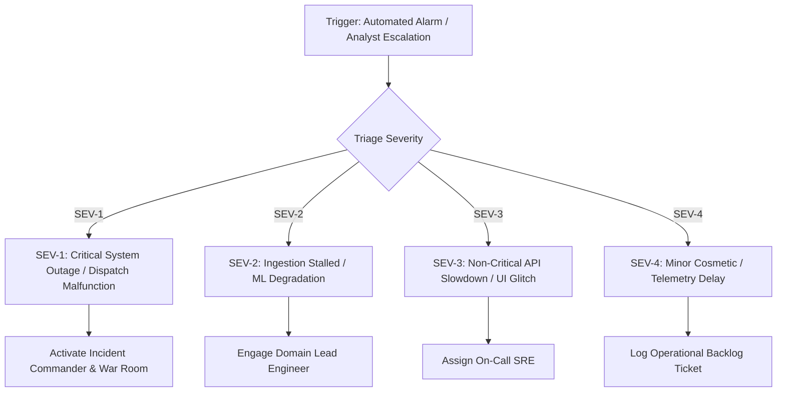

# AGNI-NETRA — INCIDENT RESPONSE RUNBOOK (IRP)

**Document ID**: IRP-AGNI-INC-001  
**Authority**: Central Security & Emergency Response Directorate  
**Classification**: Government Operations / Emergency Response Only  
**Effective Date**: 2026-09-02  

---

## 1. Incident Severity Classification & SLAs



| Severity Level | Definition | Response SLA | Target Resolution | Escalation Authority |
|---|---|---|---|---|
| **SEV-1 (CRITICAL)** | Total API/DB outage; unauthorized external dispatch attempt; corruption of sealed historical partitions. | **Immediate (< 5 min)** | **< 1 hour** | CTO, Directorate Head, CISO |
| **SEV-2 (HIGH)** | Ingestion feed stalled $>15$ min; ML inference latency $>1.5$s; worker supervisor crash loop; Redis queue exhaustion. | **< 15 min** | **< 2 hours** | SRE Lead, MLOps Lead |
| **SEV-3 (MEDIUM)** | Degraded API performance (P95 $>100$ms); non-critical spatial layer unavailable (e.g. OSM facility cache miss). | **< 30 min** | **< 8 hours** | On-Call Engineer |
| **SEV-4 (LOW)** | Minor UI cosmetic glitch; non-blocking telemetry delay $<5$ min; batch report export delay. | **< 2 hours** | **< 24 hours** | Sprint Backlog |

---

## 2. Incident Command Structure & Roles

1. **Incident Commander (IC)**: Directs overall triage, delegates playbooks, manages external communication.
2. **Operations Lead (Ops)**: Executes service restarts, inspects queue metrics, isolates failing nodes.
3. **Database Administrator (DBA)**: Monitors connection pool, manages failovers, handles isolated restores.
4. **Security Officer (SecOps)**: Investigates unauthorized access attempts, verifies secret masking and audit trail integrity.
5. **Communications Scribe**: Logs timestamps, actions taken, and drafts post-mortem timeline.

---

## 3. Incident Response Playbooks

### Playbook A: Complete FIRMS Telemetry Outage or Feed Corruption
**Symptoms**: Ingestion worker error count rising; `/api/v1/health/diagnostics` reports stream staleness $>30$ minutes.

1. **Check NASA FIRMS API Status**:
   ```bash
   curl -I "https://firms.modaps.eosdis.nasa.gov/api/country/csv"
   ```
2. **Verify API MAP_KEY Validity**:
   - Inspect `.env` file for `FIRMS_MAP_KEY`.
   - If NASA MAP_KEY quota exceeded, switch to secondary failover key:
     ```powershell
     # Update FIRMS_MAP_KEY in .env and trigger worker restart
     python -c "from backend.app.services.worker_manager import worker_manager; worker_manager.simulate_failure_and_recovery('firms_ingestion_worker')"
     ```
3. **Activate Backup Satellite Feeds**:
   - Enable local ISRO Bhuvan / INSAT-3D backup telemetry adapter.
4. **Notify Duty Analysts**:
   - Issue notification in National Command Center: `TELEMETRY_SOURCE_FALLBACK_ACTIVE`.

---

### Playbook B: PostgreSQL Connection Exhaustion / Lock Contention
**Symptoms**: API queries returning HTTP 503 `Database connection timeout`; pool size at maximum (40 connections).

1. **Inspect Active Database Locks & Long-Running Queries**:
   ```sql
   SELECT pid, now() - pg_stat_activity.query_start AS duration, query, state
   FROM pg_stat_activity
   WHERE (now() - pg_stat_activity.query_start) > interval '10 seconds'
     AND state != 'idle';
   ```
2. **Terminate Hanging Query**:
   ```sql
   SELECT pg_terminate_backend(<PID>);
   ```
3. **Recycle Connection Pool**:
   ```powershell
   python -c "from backend.app.core.database import engine; engine.dispose(); print('Pool disposed and reconnected')"
   ```

---

### Playbook C: ML Model Prediction Anomaly or Latency Spike
**Symptoms**: Prediction endpoint returning uncalibrated probabilities, anomalous class distributions, or inference $>1.5$s.

1. **Cryptographic Checksum Verification**:
   ```bash
   python -c "from backend.app.services.model_integrity_service import model_integrity_service; print(model_integrity_service.get_artifact_checksums())"
   ```
2. **Execute Model Rollback (if corruption or severe drift detected)**:
   - Follow the detailed steps in [MODEL_ROLLBACK_RUNBOOK.md](file:///e:/PROJECTS/AGNI-NETRA/MODEL_ROLLBACK_RUNBOOK.md).
   - Hot-swap to baseline `xgb-v2.0-real-candidate`.
3. **Verify Post-Rollback Predictor**:
   ```bash
   python -c "from ml.inference.predictor import thermal_predictor; print(thermal_predictor.predict({'max_frp': 150.0, 'dist_to_facility_m': 100.0, 'persistence_score': 5.0}))"
   ```

---

### Playbook D: Unauthorized Analyst Action / Security Boundary Breach Attempt
**Symptoms**: Rapid HTTP 403 / 401 spikes; attempt to access `/api/v1/alerts/verify` without `ANALYST` role.

1. **Extract Offending IP & Correlation ID**:
   ```bash
   grep "RBAC Public Role Guard" logs/agni_netra.log | tail -n 50
   ```
2. **Revoke Compromised JWT Token**:
   - Blacklist user ID in Redis token cache:
     ```bash
     redis-cli SET "blacklist:token:<USER_ID>" "REVOKED" EX 86400
     ```
3. **Audit Log Trail Preservation**:
   - Export immutable transition audit log:
     ```sql
     SELECT * FROM alert_audit_logs WHERE analyst_name = '<USER_ID>' ORDER BY timestamp DESC;
     ```

---

### Playbook E: Accidental External Dispatch Trigger Attempt
**Symptoms**: A user attempts to force-dispatch live notifications to external disaster authorities while system is in readiness or candidate mode.

1. **Confirm Controlled Dispatch Gate Enforced**:
   - Verify `ENABLE_OPERATIONAL_DISPATCH_GATE = False` in `.env` and runtime memory.
2. **Confirm Zero Database Dispatches**:
   ```sql
   SELECT COUNT(*) FROM alerts WHERE is_operational_dispatch = true;
   -- Must return 0
   ```
3. **If gate was tampered with, immediately force lock**:
   ```python
   # Emergency Lockout
   from backend.app.core.config import settings
   settings.ENABLE_OPERATIONAL_DISPATCH_GATE = False
   ```
4. **Log SEV-1 Security Incident**:
   - Notify CISO and generate forensic export.

---

## 4. Post-Incident Review (PIR) Protocol

Within 24 hours of resolving any SEV-1 or SEV-2 incident, the Incident Commander must conduct a formal Post-Incident Review covering:
1. **Executive Timeline**: Minute-by-minute breakdown from trigger to resolution.
2. **Root Cause Analysis (RCA)**: 5-Whys analysis identifying system, procedural, or code deficiencies.
3. **Action Items & Preventative Remediation**: Tracked Jira tickets assigned with 7-day SLA.
4. **Sign-off**: Formal CISO & Directorate Lead endorsement.
