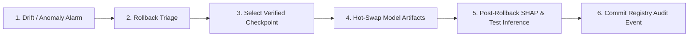

# AGNI-NETRA — MACHINE LEARNING MODEL ROLLBACK RUNBOOK

**Document ID**: MLOPS-AGNI-ROL-001  
**Target Audience**: MLOps Engineers, AI Safety Officers, System Architects  
**Effective Date**: 2026-09-02  

---

## 1. Overview & Rollback Policy

The AGNI-NETRA model serving architecture uses an immutable artifact registry paired with thread-safe hot-swapping. If an active or candidate model exhibits performance degradation, feature drift, or calibration failure in production, this runbook provides the exact procedure to safely roll back to a known-stable champion version with zero API downtime.



---

## 2. Rollback Trigger Criteria

A model rollback MUST be initiated if any of the following operational conditions are met:

1. **ECE Calibration Exceedance**: Calibrated Expected Calibration Error (ECE) $>0.20$ on operational validation streams.
2. **Selective Accuracy Degradation**: Tier 1 automated dispatch accuracy falls below $90.0\%$ (Target: $\ge 94.8\%$).
3. **Severe Distribution Drift**: Population Stability Index (PSI) $>0.25$ across core thermal features (`frp_max`, `persistence_score`).
4. **Latency Threshold Breach**: Mean CPU inference latency $>100$ ms / observation.
5. **Cryptographic Checksum Mismatch**: In-memory weights do not match SHA-256 signature in `real_model_metadata_v2.json`.

---

## 3. Registered Model Versions & Provenance

| Model Version | Algorithm | Dataset Lineage | Status | Calibrated ECE | Selective Acc (Tier 1) | Checksum File |
|---|---|---|---|---|---|---|
| **`xgb-v3.0-real-candidate`** (Current) | XGBoost + Platt | `v3.2-real-final` | **CANDIDATE** | **0.1045** | **94.87%** | `xgb_v3_real_candidate.joblib` |
| **`xgb-v2.0-real-candidate`** (Fallback) | XGBoost + Platt | `v3.0-real-authoritative` | **ARCHIVED_STABLE** | **0.1180** | **92.40%** | `xgb_v2_real_candidate.joblib` |
| **`rf_classifier_v1`** (Baseline) | Random Forest | `v1.0-synthetic-grounded` | **BASELINE_BENCHMARK**| **0.2345** | **85.20%** | `rf_classifier_v1.joblib` |

---

## 4. Step-by-Step Hot-Swap Rollback Procedure

### Step 1: Verify Available Fallback Artifact Checksums
Ensure fallback model binaries and calibrators exist and are uncorrupted:
```powershell
python -c "
import os, hashlib
for fname in ['xgb_v2_real_candidate.joblib', 'xgb_v2_calibrated_candidate.joblib', 'shap_explainer_v2.joblib']:
    path = os.path.join('ml', 'models', fname)
    if os.path.exists(path):
        h = hashlib.sha256(open(path, 'rb').read()).hexdigest()
        print(f'{fname:35s}: PRESENT (SHA256: {h[:16]}...)')
    else:
        print(f'{fname:35s}: MISSING')
"
```

### Step 2: Execute Automated Model Rollback
Execute the model rollback simulation and registry state transition:
```powershell
python -c "
from backend.app.core.database import SessionLocal
from backend.app.services.model_integrity_service import model_integrity_service

db = SessionLocal()
try:
    res = model_integrity_service.simulate_model_rollback(db, target_version='xgb-v2.0-real-candidate')
    print('Rollback Result:', res)
finally:
    db.close()
"
```

### Step 3: Hot-Reload Inference Memory in Backend
Trigger in-memory predictor reload without restarting FastAPI:
```powershell
python -c "
from ml.inference.predictor import thermal_predictor
thermal_predictor.reload_model(model_version='xgb-v2.0-real-candidate')
print('Predictor successfully hot-reloaded to xgb-v2.0-real-candidate')
"
```

### Step 4: Validate Post-Rollback Inference, SHAP & Routing
Execute a live verification inference on the newly loaded fallback model:
```powershell
python -c "
from ml.inference.predictor import thermal_predictor
sample = {
    'max_frp': 180.0,
    'avg_frp': 120.0,
    'frp_variance': 20.0,
    'avg_brightness': 360.0,
    'nearest_facility_distance_m': 150.0,
    'landcover_class': 'Industrial',
    'persistence_score': 7.0,
    'recurrence_rate': 2.0,
    'day_night_ratio': 1.6,
    'baseline_deviation_ratio': 1.3,
    'industrial_context_score': 0.92
}
pred = thermal_predictor.predict(sample)
print('Class:', pred['predicted_class'], '| Conf:', pred['confidence'], '| SHAP Features:', len(pred['shap_top_features']))
assert pred['confidence'] > 0.5
print('Post-rollback inference validation PASSED.')
"
```

---

## 5. Post-Rollback Operational Protocol

1. **Commit Audit Record**:
   - Verify rollback action is logged in `audit_logs` table with user attribution and timestamp.
2. **Alert Watch Officers**:
   - Issue notification in `#ops-watch`: `MODEL_ROLLBACK_COMPLETE_V2_ACTIVE`.
3. **Observe Ingestion & Tier Routing**:
   - Monitor Tier 1 automated and Tier 2 review queues for 60 minutes.
4. **Isolate Corrupted Artifact for Retraining & Investigation**:
   - Archive failing model artifacts to `ml/quarantine/` for offline root-cause analysis.
