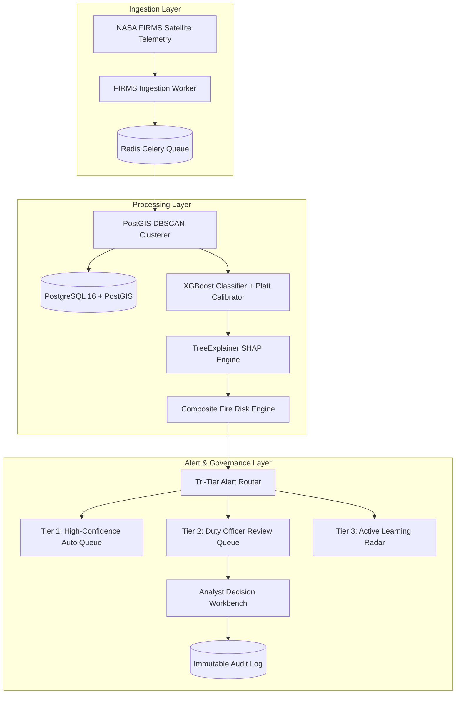

# AGNI-NETRA — STANDARD OPERATIONS RUNBOOK (SOP)

**Document ID**: SOP-AGNI-OPS-001  
**Target Audience**: Level 1 & Level 2 Operations Engineers, Watch Officers, SREs  
**Classification**: Government Operations / Internal Restricted  
**Effective Date**: 2026-09-02  

---

## 1. System Overview & Service Architecture

AGNI-NETRA is a central thermal intelligence platform ingesting satellite observations from NASA FIRMS, clustering thermal hotspots with PostGIS, classifying fires using calibrated XGBoost, generating SHAP explainability attributions, calculating multi-factor fire risk, and routing alerts via a Tri-Tier HITL decision framework.



---

## 2. Daily Watch Officer Procedures

### 2.1 Morning Shift Turnover Checklist (06:00 & 18:00 IST)
1. **Verify Subsystem Readiness**:
   ```bash
   curl -s http://localhost:8000/api/v1/health/readiness | jq .
   # Expected Output: {"ready": true, "status": "READY", "subsystems": {"database_connected": true, "model_artifacts_loaded": true, "supervised_workers_active": true}}
   ```
2. **Inspect Worker Telemetry**:
   ```bash
   curl -s http://localhost:8000/api/v1/health/diagnostics | jq .workers
   # Verify all workers have status "RUNNING" and error_count == 0
   ```
3. **Review Ingestion Stream Freshness**:
   - Verify latest telemetry timestamp is within the last 15 minutes.
   ```sql
   SELECT MAX(acq_timestamp), COUNT(*) FROM thermal_detections WHERE acq_timestamp >= NOW() - INTERVAL '1 hour';
   ```
4. **Inspect Tier 2 Review Queue**:
   - Check pending unassigned alerts requiring manual analyst verification.
   ```bash
   curl -s -H "Authorization: Bearer <TOKEN>" "http://localhost:8000/api/v1/alerts?status=NEW&tier=TIER_2_ANALYST_REVIEW_QUEUE" | jq .
   ```

---

## 3. Service Lifecycle Management

### 3.1 Starting Services
```powershell
# 1. Start Redis Broker (if not running as Windows Service)
redis-server --daemonize yes

# 2. Start PostgreSQL 16
net start postgresql-x64-16

# 3. Start AGNI-NETRA Backend API (Uvicorn)
.\venv\Scripts\uvicorn backend.app.main:app --host 0.0.0.0 --port 8000 --workers 4

# 4. Start Background Worker Manager
.\venv\Scripts\python backend\app\services\worker_manager.py

# 5. Start Next.js Frontend Command Center
cd frontend
npm run start
```

### 3.2 Graceful Service Shutdown
```powershell
# Stop FastAPI backend gracefully (allows in-flight requests to complete)
taskkill /IM uvicorn.exe /T /F

# Stop Frontend Node process
taskkill /IM node.exe /T /F
```

---

## 4. Ingestion & Queue Health Monitoring

### 4.1 Queue Backlog Thresholds & Escalation Triggers

| Metric | Normal Range | Warning Threshold | Critical Alarm (SEV-2) | Action Required |
|---|---|---|---|---|
| **Redis Celery Ingest Queue** | 0 – 500 items | > 2,000 items | > 10,000 items | Scale worker pool / inspect DB locks |
| **Ingestion Latency (FIRMS to DB)** | < 30 seconds | > 2 minutes | > 10 minutes | Check NASA API rate limits / proxy |
| **PostGIS Clustering Batch Time** | < 250 ms | > 1,000 ms | > 5,000 ms | Re-index spatial bounds (`VACUUM ANALYZE`) |
| **Model Inference Latency (Batch 50)** | < 100 ms | > 350 ms | > 1,500 ms | Hot-reload ML cache / check CPU load |

### 4.2 Handling Ingestion Duplicate Flood
If duplicate telemetry bursts are detected:
- The deterministic SHA-256 deduplication layer automatically drops duplicate records.
- To inspect duplicate metrics in logs:
  ```bash
  grep "Duplicate records rejected" logs/agni_netra.log | tail -n 20
  ```

---

## 5. Routine Database Maintenance

### 5.1 Weekly PostgreSQL Vacuum & Statistics Optimization (Sundays 02:00 IST)
```sql
-- Optimize spatial indexing and planner statistics
VACUUM (ANALYZE, VERBOSE) thermal_detections;
VACUUM (ANALYZE, VERBOSE) thermal_events;
VACUUM (ANALYZE, VERBOSE) alerts;
VACUUM (ANALYZE, VERBOSE) alert_audit_logs;

-- Reindex spatial SP-GiST and GiST indexes if spatial queries slow down
REINDEX TABLE CONCURRENTLY thermal_detections;
```

### 5.2 Purging Ephemeral Diagnostic Caches
```bash
# Purge stale Redis keys older than 24 hours
redis-cli --scan --pattern "cache:geojson:*" | xargs redis-cli del
```

---

## 6. Capacity Limits & Rate Limit Adjustments

### 6.1 Standard Capacity Thresholds
- **Max API Requests / Minute (Per User)**: 120
- **Max Concurrent Worker Tasks**: 25
- **Max GeoJSON Query Window**: 30 Days (Larger queries routed to background report generator)

### 6.2 Temporary Rate Limit Override (Emergency Crisis Mode)
To temporarily elevate analyst rate limits during a major disaster event:
1. Update `backend/app/core/config.py`:
   ```python
   RATE_LIMIT_PER_MINUTE = 600  # Emergency mode
   ```
2. Trigger rolling restart of FastAPI worker processes without database downtime.

---

## 7. Emergency Contacts & Escalation Tree

| Escalation Level | Role | Contact Channel | Response SLA |
|---|---|---|---|
| **Level 1** | Duty Watch Officer | Radio / Internal Chat `#ops-watch` | Immediate (< 5 min) |
| **Level 2** | SRE & Database On-Call | PagerDuty `#sre-oncall` | < 15 min |
| **Level 3** | MLOps & AI Systems Lead | PagerDuty `#mlops-lead` | < 30 min |
| **Executive** | National Operations Director | Secure Directorate Line | < 1 hour |
