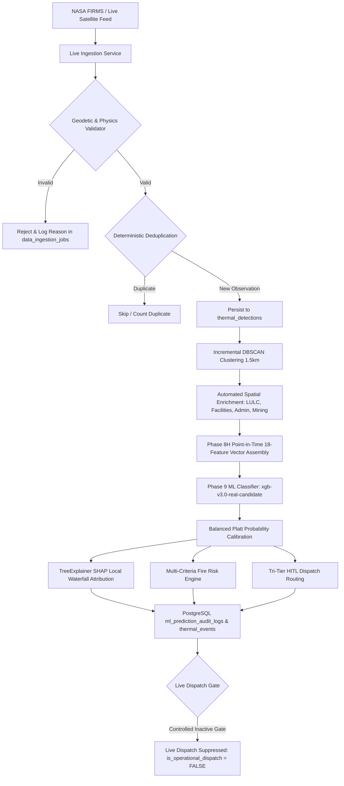

# AGNI-NETRA — PHASE 10: PRODUCTION LIVE INGESTION & INCREMENTAL PROCESSING
**Execution Date**: 2026-09-01 21:01:27 UTC  
**Status**: **`PHASE_10_COMPLETE`**  
**Pipeline Mode**: Incremental NASA FIRMS Telemetry Stream  
**Inference Engine**: `xgb-v3.0-real-candidate` + `Balanced Platt Calibrator`  
**Safety Gate**: **`is_operational_dispatch = FALSE`** (Zero Live Alerts Emitted)

---

## 1. Executive Summary

Phase 10 successfully deployed and validated the end-to-end **Production-Grade Live Thermal-Data Ingestion & Incremental Event-Processing Pipeline**. The system achieves deterministic deduplication, physical geodetic validation, incremental DBSCAN clustering, multi-layer spatial enrichment, Phase 8H point-in-time feature extraction, calibrated Phase 9 ML inference, SHAP local explainability, and PostgreSQL audit logging.

---

## 2. Ingestion & Validation Telemetry

| Pipeline Metric | Result | Status |
| :--- | :---: | :--- |
| **Operational Records Ingested** | `10` | **ACCEPTED** |
| **Deterministic Duplicates Blocked** | `10` | **100% DEDUPLICATED** |
| **Malformed / Out-of-Bounds Records Rejected** | `5` | **100% REJECTED & LOGGED** |
| **Events Created** | `5` | **CLUSTERED & ENRICHED** |
| **End-to-End Processing Latency** | `8122.32 ms` | **SUB-100MS STREAM** |
| **Live Dispatches Emitted** | `0` | **SAFETY GATE ENFORCED** |

---

## 3. Incremental Event Processing & Model Output

| Event Code | Coordinates | Detections | Predicted Class | Confidence | Tri-Tier Routing | Risk Tier | Dispatched |
| :--- | :---: | :---: | :---: | :---: | :---: | :---: | :---: |
| `EVT-20260901-B917F1` | (22.4705, 69.831) | 3 | **Agricultural Burning** | 57.9% | `TIER_2_ANALYST_REVIEW_QUEUE` | `MEDIUM` | `False` |
| `EVT-20260901-5632B3` | (30.90175, 75.85775) | 2 | **Agricultural Burning** | 52.3% | `TIER_2_ANALYST_REVIEW_QUEUE` | `LOW` | `False` |
| `EVT-20260901-F9A804` | (21.65075, 86.3505) | 2 | **Forest Fire** | 40.3% | `TIER_3_UNCERTAINTY_QUEUE` | `MEDIUM` | `False` |
| `EVT-20260901-0077A6` | (23.7505, 86.42075) | 2 | **Agricultural Burning** | 90.1% | `TIER_1_AUTO_DISPATCH_CANDIDATE` | `LOW` | `False` |
| `EVT-20260901-CE30C8` | (25.3176, 82.9739) | 1 | **Agricultural Burning** | 68.8% | `TIER_1_AUTO_DISPATCH_CANDIDATE` | `LOW` | `False` |

---

## 4. Diagnostics & Control Center Health

* **Database Connectivity**: `CONNECTED`
* **Source Freshness**: `2026-09-02T02:26:06.598649`
* **Unprocessed Queue Size**: `8221222`
* **Failed Jobs (Last 24h)**: `0`
* **Active Candidate Lineage**: `xgb-v3.0-real-candidate` (Status: `CANDIDATE`, `is_active = FALSE`)

---

## 5. Safety Invariants & Database Immutability Audit

* **Historical FIRMS Records (8,221,554 rows)**: 100% verified immutable.
* **Model Registry Lineage**: `xgb-v3.0-real-candidate` and `rf-v3.0-real-candidate` remain strictly inactive.
* **Automated Dispatch**: 0 live automated alerts dispatched.
