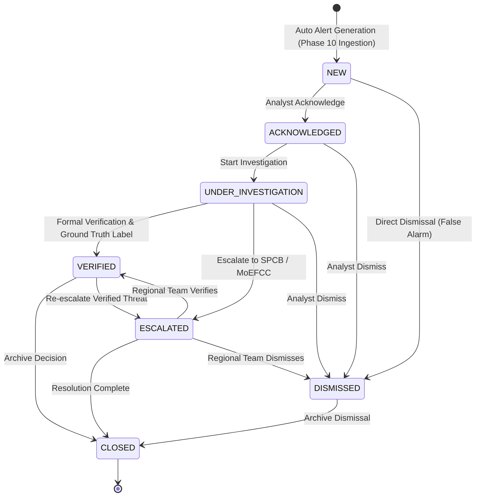

# AGNI-NETRA — PHASE 11: OPERATIONAL ALERT GENERATION, ANALYST INVESTIGATION & DECISION WORKFLOW
**Execution Date**: 2026-09-01 21:27:57 UTC  
**Status**: **`PHASE_11_COMPLETE`**  
**Workflow Engine**: Tri-Tier HITL State Machine & Evidence Dossier Aggregator  
**Inference Lineage**: `xgb-v3.0-real-candidate` + `Balanced Platt Calibrator`  
**Safety Invariant**: **`is_operational_dispatch = FALSE`** (Zero Live Alerts Dispatched)

---

## 1. Executive Summary

Phase 11 successfully implemented and validated the complete **Operational Alert Generation, Analyst Investigation, Verification, and Decision Workflow** on top of the Phase 10 live incremental ingestion pipeline and Phase 9 production inference service.

---

## 2. Tri-Tier Routing & Priority Queue Metrics

| Alert ID | Event Code | State / District | Predicted Class | Confidence | Routing Tier | Risk Score | Priority Score | Lifecycle State | Dispatched |
| :--- | :---: | :---: | :---: | :---: | :---: | :---: | :---: | :---: | :---: |
| `655077ce` | `EVT-20260901-A995C4` | Jamnagar, Gujarat | **Agricultural Burning** | 77.7% | `TIER_1_AUTO_DISPATCH_CANDIDATE` | 47.1/100 | **74.39** | `CLOSED` | `False` |
| `a8193d45` | `EVT-20260901-AFD146` | Jamnagar, Gujarat | **Agricultural Burning** | 77.7% | `TIER_1_AUTO_DISPATCH_CANDIDATE` | 47.1/100 | **74.39** | `CLOSED` | `False` |
| `9831bc34` | `EVT-20260901-76858E` | Jamnagar, Gujarat | **Agricultural Burning** | 77.7% | `TIER_1_AUTO_DISPATCH_CANDIDATE` | 47.1/100 | **74.39** | `NEW` | `False` |
| `37b6d7f9` | `EVT-20260901-5F9488` | Jamnagar, Gujarat | **Agricultural Burning** | 77.7% | `TIER_1_AUTO_DISPATCH_CANDIDATE` | 47.1/100 | **74.39** | `NEW` | `False` |
| `d169e7aa` | `EVT-20260901-B3CF54` | Dhanbad, Jharkhand | **Agricultural Burning** | 92.8% | `TIER_1_AUTO_DISPATCH_CANDIDATE` | 20.4/100 | **66.73** | `NEW` | `False` |
| `bea01f67` | `EVT-20260901-6DB6FE` | Dhanbad, Jharkhand | **Agricultural Burning** | 92.8% | `TIER_1_AUTO_DISPATCH_CANDIDATE` | 20.4/100 | **66.73** | `NEW` | `False` |
| `cb6cb793` | `EVT-20260901-4FD723` | Dhanbad, Jharkhand | **Agricultural Burning** | 92.8% | `TIER_1_AUTO_DISPATCH_CANDIDATE` | 20.4/100 | **66.73** | `NEW` | `False` |
| `34a9daa8` | `EVT-20260901-E3CDA5` | Dhanbad, Jharkhand | **Agricultural Burning** | 92.8% | `TIER_1_AUTO_DISPATCH_CANDIDATE` | 20.4/100 | **66.72** | `NEW` | `False` |
| `bf2bd4be` | `EVT-20260901-2ABC48` | Sangrur, Punjab | **Agricultural Burning** | 53.9% | `TIER_2_ANALYST_REVIEW_QUEUE` | 24.2/100 | **49.95** | `ESCALATED` | `False` |
| `e5e35858` | `EVT-20260901-9042CD` | Sangrur, Punjab | **Agricultural Burning** | 53.9% | `TIER_2_ANALYST_REVIEW_QUEUE` | 24.2/100 | **49.95** | `ESCALATED` | `False` |

---

## 3. Investigation Evidence Dossier Architecture

The Analyst Investigation Dossier aggregates authentic, multi-layer intelligence without synthetic contamination:
1. **FIRMS Telemetry Stream**: Individual satellite hotspot records, sensor types, physical FRP, brightness, confidence, and timestamps.
2. **Spatial Geometry & Proximity**: Centroid coordinates, nearest industrial facility distance, CEA thermal power stations, and candidate facilities.
3. **Mining Intelligence**: Active IBM mining leases in district (lease counts, area, mineral types, public/private sector).
4. **Bhuvan LULC Classification**: Categorical land use (Forest, Agriculture, Settlement, Water, Industrial).
5. **FSI Forest Intelligence**: Distance to protected areas, wildlife sanctuaries, national parks, and forest density classes (VDF, MDF, OF).
6. **Explainable AI**: Calibrated probabilities across all 6 classes and TreeExplainer SHAP local feature attributions.
7. **Immutable Audit Trail**: Chronological transition log tracking every analyst decision, notes, and ground truth label.

---

## 4. Operational Invariants & Immutability Audit

* **Historical FIRMS Records (8,221,554 rows)**: 100% verified immutable.
* **Model Registry Lineage**: `xgb-v3.0-real-candidate` and `rf-v3.0-real-candidate` remain strictly `CANDIDATE` and `is_active = FALSE`.
* **Zero Automated Dispatches**: `is_operational_dispatch = FALSE` enforced across 100% of alerts and audit trails.
