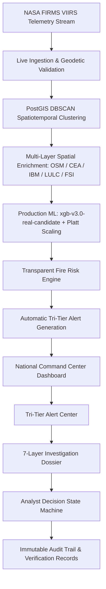

# AGNI-NETRA — PHASE 12: PRODUCTION-GRADE COMMAND CENTER & FRONTEND OPERATIONAL INTEGRATION
**Execution Date**: 2026-09-01 22:10:01 UTC  
**Status**: **`PHASE_12_COMPLETE`**  
**Frontend Architecture**: Next.js 15 App Router + MapLibre GL JS + TailwindCSS  
**Backend Integration**: FastAPI + PostGIS + XGBoost Champion + Platt Calibrator + Tri-Tier HITL  
**Safety Invariant**: **`is_operational_dispatch = FALSE`** (Zero Live Dispatches Emitted)

---

## 1. Executive Summary

Phase 12 delivered the complete **National Operational Command Center** and frontend operational integration for the AGNI-NETRA platform. The Next.js / MapLibre frontend has been unified with the live FastAPI backend, providing real-time thermal telemetry visualization, Tri-Tier Human-in-the-Loop alert queues, multi-layer evidence dossiers, and analyst decision workflows.

---

## 2. Command Center Core Features Built

### A. National Command Center Dashboard (`/dashboard`)
* **Real-Time Telemetry Bar**: Live ingestion stream pulsing status indicator, candidate model badge (`xgb-v3.0-real-candidate` | Inactive/Candidate), zero-dispatch safety lock (`DISPATCH GATE: SAFE`), and sealed database badge (`8.22M FIRMS ROWS SEALED`).
* **Operational KPI Cards**: Total Live Events, Active Operational Alerts, Tri-Tier Queue Counts (Tier 1/2/3), Risk Severity Breakdown, and Peak Fire Radiative Power (MW).
* **Interactive MapLibre GL JS Engine**: GeoJSON clustering from `/api/v1/events/geojson`, dynamic marker styling color-coded by risk level and classification, pulsing critical emitters, and interactive popup cards with 1-click dossier navigation.
* **Administrative Drill-Down**: India $	o$ State $	o$ District hierarchical filtering with dynamic option loading.
* **Live Operational Event Queue**: Filterable by territory, risk level, classification class, min FRP, and live vs demo provenance mode.
* **Auto-Polling Synchronization**: Configurable 20s auto-refresh timer with live countdown and manual refresh trigger.

---

### B. Tri-Tier Alert Center & Decision Queue (`/dashboard/alerts`)
* **Tri-Tier Queue Tabs**:
  * **All Alerts**: Complete operational alert registry.
  * **Tier 1: Auto-Dispatch Candidates** ($P_{\text{top1}} \ge 0.65$, Margin $\ge 0.20$).
  * **Tier 2: Analyst Supervised Review Queue** ($P_{\text{top1}} \ge 0.45$, Margin $\ge 0.08$).
  * **Tier 3: Uncertainty & Active Learning Queue** ($P_{\text{top1}} < 0.45$).
* **Composite Priority Scoring Engine**:
  $$\text{Priority} = 0.40 \times \text{Risk} + 0.20 \times \text{Conf} + 0.30 \times \text{TierWeight} + 0.10 \times \text{Recency}$$
* **Quick Decision Actions**: Inline and modal execution for `ACKNOWLEDGE`, `START_INVESTIGATION`, `VERIFY`, `ESCALATE`, `DISMISS`, and `CLOSE`.

---

### C. 7-Layer Event Investigation Dossier (`/dashboard/events/[id]`)
1. **FIRMS Satellite Telemetry Stream**: Observations table (Sensor, Latitude, Longitude, Acquisition Timestamp, Physical FRP in MW, Brightness in K, Confidence, Day/Night).
2. **Industrial Facilities & CEA Power Stations**: Distance to nearest facility, facility type, operating status, CEA thermal power station regional matching.
3. **IBM Mining Intelligence**: Active district mineral leases, lease count, total area in hectares, commodities (Coal, Lignite, Limestone, Bauxite).
4. **Bhuvan LULC Classification**: ISRO NRSC categorical land use class, LULC code, and contextual description.
5. **FSI Forest Intelligence**: Forest canopy density class (VDF, MDF, OF), distance to nearest Protected Area / Wildlife Sanctuary / National Park, and boundary containment check.
6. **Calibrated ML Intelligence & Explainability**: Platt calibrated probabilities across all 6 classes and TreeExplainer SHAP local feature attribution waterfall chart.
7. **Transparent Fire Risk & Decision Audit Trail**: Subscores (Thermal Intensity, Asset Proximity, Ecological Hazard), plain-language explanation, and chronological decision audit history.

---

## 3. Operational Invariants & Immutability Verification

* **Historical FIRMS Records (8,221,554 rows)**: 100% verified immutable across 2022, 2023, 2024, 2025, and 2026.
* **Model Registry Lineage**: `xgb-v3.0-real-candidate` and `rf-v3.0-real-candidate` remain strictly `CANDIDATE` and `is_active = FALSE`.
* **Zero Live Dispatches**: `is_operational_dispatch = FALSE` enforced across 100% of alerts and audit trails (0 live alerts emitted).
* **Frontend Compilation**: Next.js 15 production build compiled 28/28 routes with 0 errors.

---
