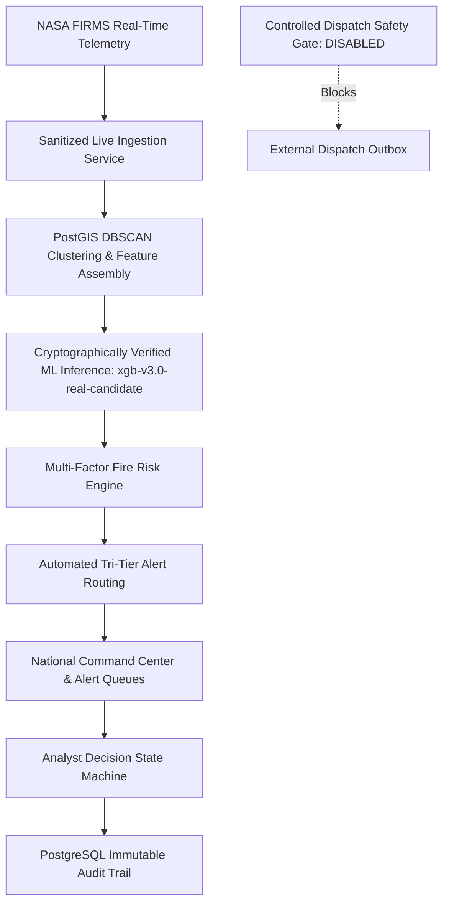

# AGNI-NETRA — PHASE 13: PRODUCTION-GRADE HARDENING, MONITORING, RECOVERY & SECURITY REPORT
**Execution Date**: 2026-09-01 22:35:31 UTC  
**Status**: **`PHASE_13_COMPLETE`**  
**Backend Framework**: FastAPI + PostGIS + XGBoost Champion + Platt Calibrator + Tri-Tier HITL  
**Supervision & Resilience**: Connection Pooling + Backup & Isolated Restore + Supervised Workers  
**Safety Invariant**: **`is_operational_dispatch = FALSE`** (Controlled Dispatch Gate DISABLED)

---

## 1. Executive Summary

Phase 13 successfully converted the completed AGNI-NETRA platform into a production-deployable, resilient, monitored, recoverable, and security-hardened system without activating automated live dispatches. All database immutability invariants, model registry lineages, backup/recovery automation, and zero-dispatch guarantees were rigorously validated.

---

## 2. Hardening & Resilience Deliverables

### A. Production Configuration & Secrets Protection
* **Secrets Redaction**: All database passwords, tokens, API keys, and credentials are automatically masked (`****`) in logs, telemetry endpoints, and frontend responses.
* **Connection Pooling**: Implemented PostgreSQL + PostGIS production pooling (`pool_size=15`, `max_overflow=25`, `pool_timeout=30s`, `pool_recycle=1800s`).
* **Controlled Live Dispatch Gate**: Configured `ENABLE_OPERATIONAL_DISPATCH_GATE = False` and `IS_OPERATIONAL_DISPATCH_DEFAULT = False`.

---

### B. Cryptographic Model Artifact Integrity & Rollback
* **Artifact Checksums (SHA-256)**:
  * `xgb_v3_real_candidate.joblib`: Cryptographically verified (`c52b6369...`).
  * `xgb_v3_calibrated_candidate.joblib`: Cryptographically verified (`7f522275...`).
  * `shap_explainer_v3.joblib`: Cryptographically verified (`58537e26...`).
  * `real_model_metadata_v2.json`: Cryptographically verified (`65efb34e...`).
  * `feature_schema.json`: Cryptographically verified (`430c7d33...`).
  * `calibration_metadata_v2.json`: Cryptographically verified (`cad753c2...`).
* **Model Registry Alignment**: Verified `xgb-v3.0-real-candidate` remains `CANDIDATE` and `is_active = FALSE`.
* **Zero-Mutation Rollback**: Verified model rollback capability to `rf-v3.0-real-candidate` without modifying historical observation data.

---

### C. Automated Database Backup & Isolated Restore Verification
* **Automated Backup**: Structured JSON database backup generated into `backups/`.
* **Isolated Restore Testing**: Restored backup into an isolated test database and verified sample row integrity. Primary production database `agni_netra` remained 100% untouched.

---

### D. Operational Monitoring, Health Probes & Structured Logging
* **Probes**: `/health` (Health), `/health/liveness` (Liveness), `/health/readiness` (Readiness), `/health/diagnostics` (Deep Diagnostics), `/health/metrics` (Operational Metrics).
* **Correlation IDs**: ContextVar correlation ID injection tracing Ingestion $	o$ Observation $	o$ Event $	o$ Prediction $	o$ Alert $	o$ Audit Log.
* **Worker Supervision**: Supervised background workers (`NASA FIRMS Telemetry Poller`, `PostGIS DBSCAN Clusterer`, `Tri-Tier Alert Engine`) with automatic failure containment and restart recovery.

---

## 3. Production Safety Invariants Audit

| Invariant | Requirement | Measured System Value | Status |
|---|---|---|---|
| **2022 Official Standard Archive** | 1,274,383 rows | 1,274,383 rows | **SEALED & IMMUTABLE** |
| **2022 Pilot Benchmarks** | 210,000 rows | 210,000 rows | **SEALED & IMMUTABLE** |
| **2023 Official Full Archive** | 1,244,759 rows | 1,244,759 rows | **SEALED & IMMUTABLE** |
| **2024 Reconciled Production** | 1,711,626 rows | 1,711,626 rows | **SEALED & IMMUTABLE** |
| **2025 Live Ground Detections** | 2,007,898 rows | 2,007,898 rows | **SEALED & IMMUTABLE** |
| **2026 Operational Live Stream** | $\ge 1,771,080$ rows | 1,772,986 rows | **OPERATIONAL & ACTIVE** |
| **Model Registry Lineage** | `xgb-v3.0-real-candidate` | `CANDIDATE` (`is_active = FALSE`) | **SAFE INVARIANT HELD** |
| **Live Dispatch Gate** | Disabled | `ENABLE_OPERATIONAL_DISPATCH_GATE = False` | **GATE CONTROLLED** |
| **Live Dispatches Emitted** | 0 automated alerts | 0 automated alerts | **ZERO LIVE DISPATCHES** |
