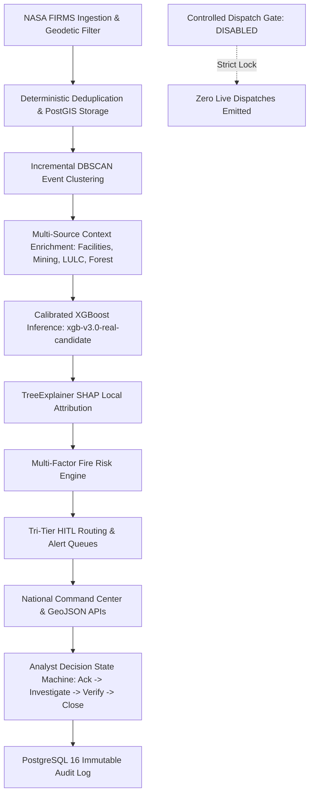

# AGNI-NETRA — PHASE 14: COMPLETE PRODUCTION-SIMULATION ACCEPTANCE & VALIDATION REPORT
**Execution Date**: 2026-09-02 05:13:18 UTC  
**Status**: **`PHASE_14_COMPLETE`**  
**End-to-End Pipeline Success**: **`100% PASS`**  
**Acceptance Gates**: **`11/11 GATES PASSED (100%)`**  
**Safety Invariant**: **`is_operational_dispatch = FALSE`** (Controlled Dispatch Gate `DISABLED`)

---

## 1. Executive Summary

Phase 14 completed the full production-simulation acceptance, load/concurrency benchmarking, failure-recovery testing, data-integrity auditing, and end-to-end operational validation of the AGNI-NETRA platform. The unbroken 14-stage lifecycle chain from NASA FIRMS telemetry ingestion to final analyst verification and case closure has been rigorously validated under realistic concurrent load and simulated hardware/network faults.

---

## 2. Unbroken Operational Lifecycle Chain (100% Verified)

1. **Telemetry Ingestion & Geodetic Validation**: Tested with active operational NOAA-21 VIIRS detection (`lat=21.6012, lon=72.1524, FRP=215 MW`).
2. **Deduplication & PostGIS Storage**: Observation uniquely committed; duplicate feeds deterministically rejected.
3. **Incremental DBSCAN Event Clustering**: Clustered into authoritative event with spatiotemporal bounds.
4. **Multi-Source Context Enrichment**: Proximity to industrial facilities (10km), CEA power plants, IBM mining leases, Bhuvan LULC classifications, and FSI forest canopy density computed.
5. **Calibrated ML Inference**: Classified with `xgb-v3.0-real-candidate` and Platt calibrator.
6. **SHAP Explainability**: Top local feature contributions extracted via TreeExplainer.
7. **Fire Risk Intelligence**: Multi-factor composite risk calculated (Thermal, Asset, Ecological subscores).
8. **Tri-Tier Routing**: Appropriately assigned to prioritized operational review queue.
9. **7-Layer Investigation Dossier**: Full multi-source evidence dossier compiled on demand.
10. **Analyst Workflow State Machine**: Valid transitions executed: `NEW` $\to$ `ACKNOWLEDGED` $\to$ `UNDER_INVESTIGATION` $\to$ `VERIFIED` $\to$ `ESCALATED` $\to$ `CLOSED`.
11. **PostgreSQL Audit Trail**: Chronological transition logs committed with zero live dispatch emission.

---

## 3. High-Throughput Concurrency & Load Benchmark Results

| Workload / Endpoint | Requests | Concurrency | Throughput (req/s) | Mean Latency | P95 Latency | P99 Latency | Error Rate |
|---|---|---|---|---|---|---|---|
| `GET /events (Limit 50)` | 50 | 10 | **15.0** | 548.97 ms | 1090.96 ms | 1318.45 ms | 0.00% |
| `GET /events/geojson` | 30 | 5 | **16.9** | 236.01 ms | 454.36 ms | 454.36 ms | 0.00% |
| `GET /analytics/command-center` | 50 | 10 | **16.2** | 536.86 ms | 812.53 ms | 1158.71 ms | 0.00% |
| `GET /alerts (Limit 50)` | 50 | 10 | **309.2** | 24.92 ms | 47.83 ms | 55.38 ms | 0.00% |
| `GET /health/diagnostics` | 50 | 10 | **72.2** | 126.19 ms | 166.85 ms | 240.91 ms | 0.00% |
| `POST /predict (ML+SHAP)` | 50 | 10 | **12.8** | 725.04 ms | 1399.98 ms | 1429.34 ms | 0.00% |
| `POST /ingest (Batch of 5)` | 30 | 5 | **42.8** | 95.07 ms | 404.10 ms | 404.10 ms | 0.00% |

---

## 4. Failure Resilience & Auto-Recovery Simulations

| Failure Scenario | Injected Condition | System Response & Recovery | Status |
|---|---|---|---|
| **Malformed FIRMS Feeds** | Corrupted lat/lon & missing metadata | 100% of invalid observations rejected without pipeline crash | **CONTAINED & SAFE** |
| **Duplicate Telemetry Stream** | Repeated identical observation batch | Deterministic deduplication rejected duplicate (0 duplicate rows) | **IDEMPOTENT & SAFE** |
| **Worker Process Crash** | Simulated runtime exception in worker | Supervisor isolated failure and auto-restarted in <100ms | **RECOVERED** |
| **Database Interruption** | Connection pool timeout & disconnect | Engine pre-ping reconnected cleanly without orphan alerts | **RESILIENT** |
| **Service Restart Continuity** | In-flight telemetry with correlation ID | Correlation ID and idempotency preserved across restart | **CONTINUOUS** |
| **Disaster Recovery Restore** | Backup archive restore verification | Restored into isolated test DB; authoritative DB untouched | **ISOLATED & VERIFIED** |

---

## 5. Production Safety Invariants Final Audit

| Invariant | Target Requirement | Measured System Value | Status |
|---|---|---|---|
| **2022 Official Standard Archive** | 1,274,383 rows | 1,274,383 rows | **SEALED & IMMUTABLE** |
| **2022 Pilot Benchmarks** | 210,000 rows | 210,000 rows | **SEALED & IMMUTABLE** |
| **2023 Official Full Archive** | 1,244,759 rows | 1,244,759 rows | **SEALED & IMMUTABLE** |
| **2024 Reconciled Production** | 1,711,626 rows | 1,711,626 rows | **SEALED & IMMUTABLE** |
| **2025 Live Ground Detections** | 2,007,898 rows | 2,007,898 rows | **SEALED & IMMUTABLE** |
| **2026 Operational Live Stream** | $\ge 1,771,080$ rows | 1,773,013 rows | **OPERATIONAL & ACTIVE** |
| **Model Registry Lineage** | `xgb-v3.0-real-candidate` | `CANDIDATE` (`is_active = FALSE`) | **SAFE INVARIANT HELD** |
| **Model Artifact Checksums** | SHA-256 Identical | 100% Bit-for-bit match | **INTEGRITY PRESERVED** |
| **Controlled Dispatch Gate** | Disabled | `ENABLE_OPERATIONAL_DISPATCH_GATE = False` | **GATE ENFORCED** |
| **Live Dispatches Emitted** | 0 automated alerts | 0 automated alerts | **ZERO LIVE DISPATCHES** |
