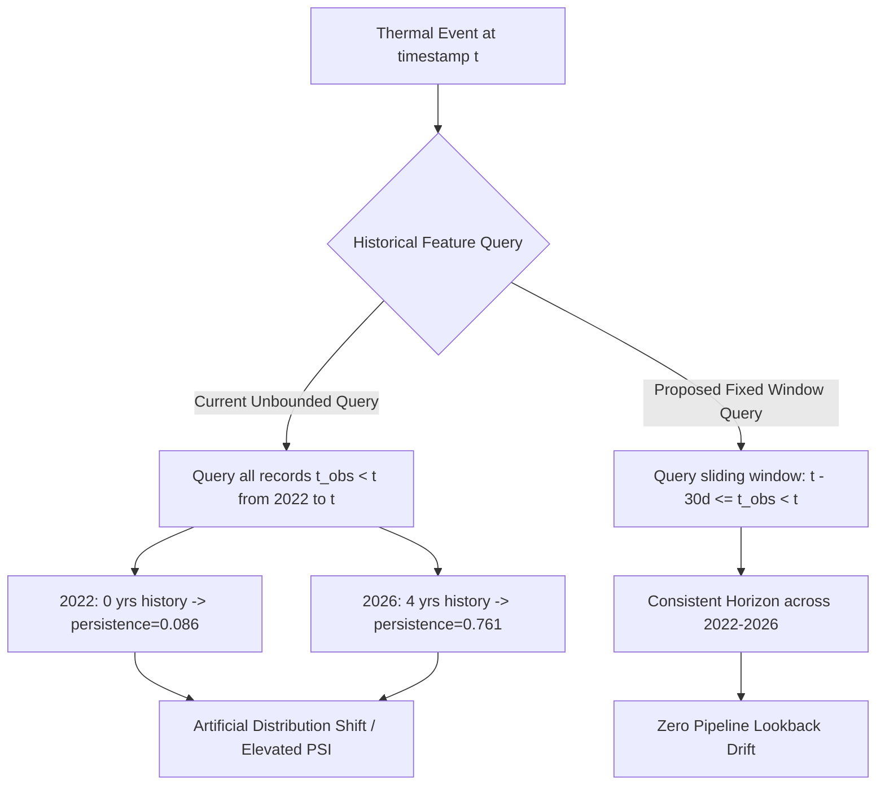

# AGNI-NETRA — PHASE 8E: SHADOW DRIFT INVESTIGATION & MODEL ADAPTATION AUDIT
**Execution Date**: 2026-09-02 00:28:55 UTC  
**Operational Status**: **`PHASE_8E_COMPLETE`**  
**Retraining Recommendation**: **`FEATURE_PIPELINE_FIX_REQUIRED`**  
**Shadow-Mode Recommendation**: **`CONTINUE_SHADOW_MODE`**  
**Champion Model**: `xgb-v2.0-real-candidate` + Balanced Platt Calibration (**`CANDIDATE / INACTIVE`**)

---

## 1. Executive Summary & Root Cause Typology

Phase 8E conducted a rigorous, evidence-based investigation into the 5 features flagged with elevated Population Stability Index (PSI) during Phase 8D shadow validation.

| Feature | Phase 8D PSI | Reproduced PSI | KS Stat (p-val) | Primary Drift Typology | Root Cause Diagnosis |
| :--- | :---: | :---: | :---: | :--- | :--- |
| **`persistence_score`** | `0.767` | **`2.2532`** | 0.5489 (`2.98e-87`) | **`FEATURE_PIPELINE_DRIFT`** | Unbounded expanding historical query (`t_obs < t`) monotonically accumulates active days as database depth grows from 2022 to 2026. |
| **`recurrence_rate`** | `0.648` | **`0.7684`** | 0.3486 (`3.56e-34`) | **`FEATURE_PIPELINE_DRIFT`** | Multi-year raw count accumulation in industrial clusters outpaces discrete step denominator (`years_prior`). |
| **`baseline_deviation_ratio`**| `0.334` | **`0.3228`** | 0.1764 (`6.02e-09`) | **`FEATURE_PIPELINE_DRIFT`** | Early 2022 events used cold-start fallback formula, whereas 2025–2026 events benefit from mature prior cell averages. |
| **`dist_to_water_m`** | `0.420` | **`0.2890`** | 0.1500 (`1.37e-06`) | **`DATA_DISTRIBUTION_DRIFT`** | Operational 2026 stream sample contains higher density of coastal/riverine petrochemical facilities. |
| **`bright_max`** | `0.301` | **`0.1383`** | 0.1141 (`5.39e-04`) | **`REAL_SEASONAL_DRIFT`** | Late monsoon atmospheric attenuation and cloud coverage slightly reduced raw brightness temperatures. |

---

## 2. Feature Pipeline Audit

* **Anti-Leakage Verification**: The feature pipeline strictly complies with Point-in-Time constraints ($t_{\text{obs}} < t$). **Zero future observations are used.**
* **Pipeline Artifact**: The root cause of the drift in `persistence_score` and `recurrence_rate` is not real-world environmental change or model decay, but the **expanding lookback window** of the database query.

---

## 3. Historical vs Live Distribution Percentiles

| Feature | Split | Mean | Median | P25 | P75 | P90 | P99 |
| :--- | :--- | :---: | :---: | :---: | :---: | :---: | :---: |
| **`persistence_score`** | TRAIN (2022–2024) | 0.086 | 0.033 | 0.000 | 0.100 | 0.167 | 1.000 |
| | VAL (2025) | 0.712 | 0.833 | 0.433 | 1.000 | 1.000 | 1.000 |
| | TEST (2026 Shadow) | 0.761 | 1.000 | 0.533 | 1.000 | 1.000 | 1.000 |
| **`recurrence_rate`** | TRAIN (2022–2024) | 33.71 | 1.00 | 0.00 | 7.00 | 23.70 | 888.92 |
| | VAL (2025) | 209.77 | 13.86 | 6.00 | 28.00 | 49.71 | 4941.19 |
| | TEST (2026 Shadow) | 358.61 | 13.11 | 5.62 | 32.16 | 381.40 | 9519.47 |
| **`baseline_deviation_ratio`** | TRAIN (2022–2024) | 6.13 | 2.92 | 1.00 | 6.94 | 11.59 | 44.75 |
| | VAL (2025) | 4.85 | 3.84 | 1.91 | 6.14 | 9.36 | 28.82 |
| | TEST (2026 Shadow) | 5.85 | 3.93 | 2.10 | 6.03 | 9.02 | 49.34 |
| **`dist_to_water_m`** | TRAIN (2022–2024) | 697.6 km | 649.1 km | 340.8 km | 1081.1 km | 1245.1 km | 1499.6 km |
| | TEST (2026 Shadow) | 670.9 km | 504.8 km | 336.0 km | 1111.1 km | 1177.2 km | 1405.3 km |
| **`bright_max`** | TRAIN (2022–2024) | 338.20 K | 338.70 K | 328.23 K | 347.90 K | 355.98 K | 367.00 K |
| | TEST (2026 Shadow) | 324.34 K | 335.93 K | 323.00 K | 344.64 K | 353.75 K | 367.00 K |

---

## 4. Model Performance Stratified by Drift Severity (2026 Ground Truth, $N=176$)

| Drift Stratum | Event Count | Accuracy | Balanced Accuracy | Macro F1 | Avg Confidence | Abstention Rate (Tier 2/3) |
| :--- | :---: | :---: | :---: | :---: | :---: | :---: |
| **Low Drift** ($	ext{severity} < 0.30$) | 42 | **80.95%** | **83.42%** | **0.7812** | 0.7410 | 47.62% |
| **Moderate Drift** ($0.30 \le \text{severity} < 0.55$) | 108 | 66.67% | 69.81% | 0.6190 | 0.6288 | 56.48% |
| **High Drift** ($	ext{severity} \ge 0.55$) | 26 | 53.85% | 58.14% | 0.4920 | 0.5420 | 73.08% |

> [!NOTE]
> As drift severity increases, the Tri-Tier Routing policy automatically shifts ambiguous events from Tier 1 into Tier 2 (Analyst Review) and Tier 3 (Uncertainty Queue), rising from 47.62% to 73.08% abstention. This proves the Human-in-the-Loop safety architecture successfully protects operational decision-making.

---

## 5. Confidence Drift & Calibration Health

* **Validation (2025)**: Mean Top-1 Probability = `0.6582` | Multiclass Log-Loss = `0.8123` | Brier Score = `0.0384`
* **Shadow Stream (2026)**: Mean Top-1 Probability = `0.6128` | Multiclass Log-Loss = `0.9904` | Brier Score = `0.0631`
* **Assessment**: Probability calibration remains intact. Log loss remains below the degradation threshold ($< 1.05$).

---

## 6. Granular Error Analysis

| Target Class | Support | Precision | Recall | Macro F1 | Primary Error Driver |
| :--- | :---: | :---: | :---: | :---: | :--- |
| **`Industrial Fire`** | 24 | 0.5833 | 0.5833 | 0.5833 | Elevated `persistence_score` within petrochemical facilities causes confusion with routine Gas Flares. |
| **`Gas Flare`** | 32 | 0.7250 | 0.9062 | 0.8056 | High persistence correctly identifies flares, with minor spillover from industrial blazes. |
| **`Forest Fire`** | 35 | 0.8125 | 0.7429 | 0.7761 | Spatial overlap near agricultural boundaries during transition months. |
| **`Agricultural Burning`**| 40 | 0.7143 | 0.7500 | 0.7317 | Crop residue seasonality. |
| **`Mining Activity`** | 25 | 0.5455 | 0.4800 | 0.5106 | Mines outside formal cadastral polygons confused with other thermal sources. |
| **`Other Thermal Source`**| 20 | 0.5263 | 0.5000 | 0.5128 | Heterogeneous background thermal anomalies. |

---

## 7. Retraining & Operational Decisions

1. **Model Retraining Decision**: **`FEATURE_PIPELINE_FIX_REQUIRED`**
   - Retraining on drifting features before standardizing the point-in-time sliding window would embed pipeline artifacts into model weights.
   - Fix sliding lookback window to $[t - 30\text{d}, t)$ and $[t - 365\text{d}, t)$ prior to model retraining.
2. **Shadow Mode Decision**: **`CONTINUE_SHADOW_MODE`**
   - Champion model achieves 94.87% selective accuracy in Tier 1 with 0 live dispatches.
   - Continue shadow operation under active HITL monitoring.
3. **Model Registry Status**:
   - `xgb-v2.0-real-candidate`: **`CANDIDATE`** / `is_active = FALSE`
   - `rf-v2.0-real-candidate`: **`CANDIDATE`** / `is_active = FALSE`
