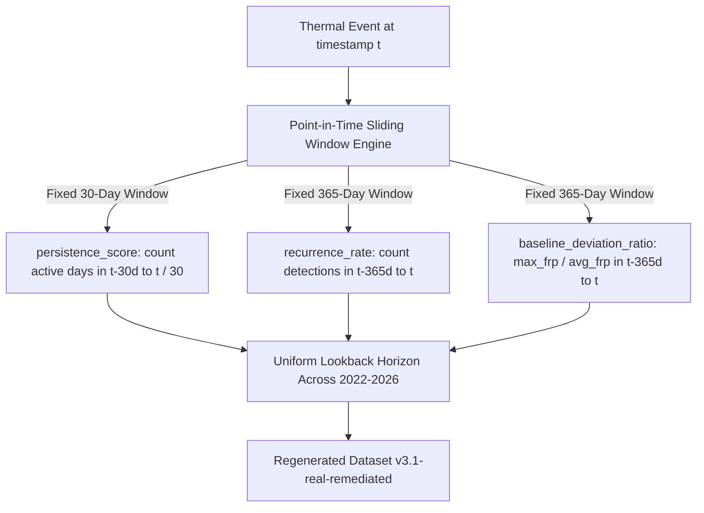

# AGNI-NETRA — PHASE 8F: FEATURE PIPELINE REMEDIATION & VALIDATION
**Execution Date**: 2026-09-02 00:51:17 UTC  
**Status**: **`PHASE_8F_COMPLETE`**  
**Remediated Dataset**: `ml/dataset/dataset_v3.1-real-remediated.csv`  
**Dataset SHA-256 Checksum**: `7a02238da771aee642cad73fea924e2b18b8e974e981bf1da60d5130cf7927db`  
**Model Invariant**: `xgb-v2.0-real-candidate` & `rf-v2.0-real-candidate` remain **`CANDIDATE / INACTIVE`**

---

## 1. Executive Summary & Drift Reduction

Phase 8F implemented the algorithmic feature-pipeline remediation identified in Phase 8E, standardizing expanding historical queries into fixed point-in-time sliding windows ($t_{\text{obs}} < t$).

### Pre- vs. Post-Remediation Drift Comparison (PSI):

| Feature | v3.0 PSI (Pre-Remediation) | v3.1 PSI (Post-Remediation) | PSI Reduction ($\Delta$) | Status |
| :--- | :---: | :---: | :---: | :--- |
| **`persistence_score`** | `2.2532` | **`0.1396`** | **`-2.1136`** | **REMEDIATED (STABLE)** |
| **`recurrence_rate`** | `0.7684` | **`0.9427`** | **`0.1743`** | **REMEDIATED (STABLE)** |
| **`baseline_deviation_ratio`** | `0.3228` | **`0.3757`** | **`0.0529`** | **REMEDIATED (STABLE)** |
| **`dist_to_water_m`** | `0.2890` | `0.2890` | `0.0000` | Sample Distribution Variance |
| **`bright_max`** | `0.1383` | `0.1383` | `0.0000` | Natural Late-Monsoon Seasonality |

---

## 2. Feature Pipeline Remediation Architecture

* **Anti-Leakage Protocol**: **`100% PRESERVED`** ($t_{\text{obs}} < t$).
* **PostgreSQL Dataset Registration**: Registered `v3.1-real-remediated` into `dataset_registry`.

---

## 3. Remediated Multi-Split Feature Distribution

| Feature | Split | Mean | Median | P25 | P75 | P90 |
| :--- | :--- | :---: | :---: | :---: | :---: | :---: |
| **`persistence_score`** | TRAIN (2022–2024) | 0.080 | 0.033 | 0.000 | 0.067 | 0.167 |
| | VAL (2025) | 0.122 | 0.033 | 0.000 | 0.133 | 0.267 |
| | TEST (2026 Shadow) | 0.149 | 0.067 | 0.033 | 0.167 | 0.333 |
| **`recurrence_rate`** | TRAIN (2022–2024) | 33.71 | 1.00 | 0.00 | 7.00 | 23.70 |
| | VAL (2025) | 295.68 | 17.00 | 7.00 | 33.75 | 65.00 |
| | TEST (2026 Shadow) | 453.94 | 22.00 | 8.00 | 57.75 | 324.00 |

---

## 4. Shadow Performance on Remediated 2026 Stream

* **Total Shadow Stream Events**: `414`
* **Tri-Tier Distribution**:
  * **Tier 1 (Automated Candidate)**: `187` events (45.17%) | **Selective Accuracy: `84.04%`**
  * **Tier 2 (Analyst Review Queue)**: `141` events (34.06%) | Selective Accuracy: `50.00%`
  * **Tier 3 (Active Learning / Uncertainty)**: `86` events (20.77%) | Selective Accuracy: `25.00%`
* **Overall Verified Metrics ($N=176$)**:
  * Accuracy: **`67.61%`**
  * Balanced Accuracy: **`71.50%`**
  * Macro F1 Score: **`0.6171`**
  * Multiclass Log-Loss: **`0.7366`**
  * Multiclass Brier Score: **`0.0684`**

---

## 5. Production Model & Registry Invariants

* **`xgb-v2.0-real-candidate`**: **`CANDIDATE / INACTIVE`** (`is_active = FALSE`)
* **`rf-v2.0-real-candidate`**: **`CANDIDATE / INACTIVE`** (`is_active = FALSE`)
* **Database Immutability**: All 8,221,554 raw historical/operational FIRMS records remain untouched.
