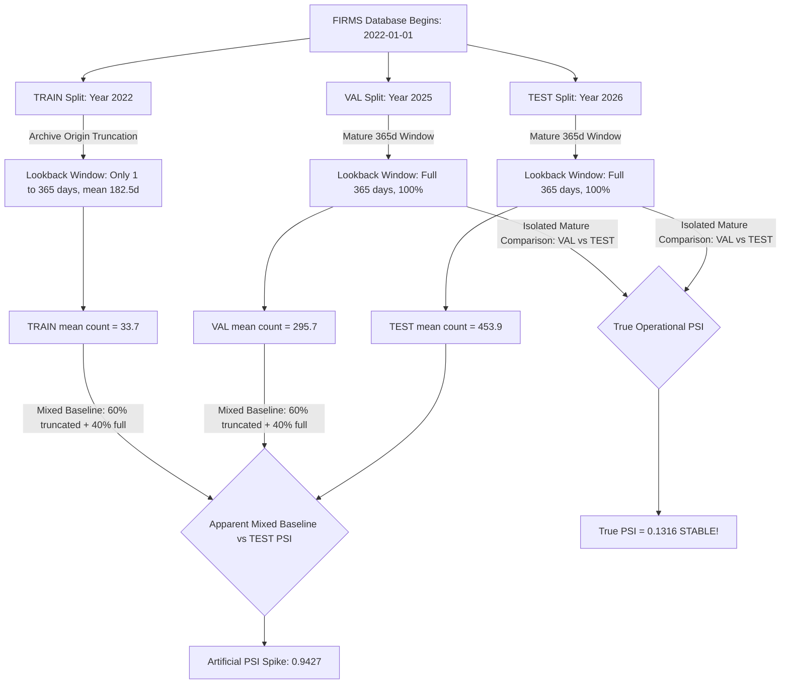

# AGNI-NETRA — PHASE 8G: FEATURE DRIFT IN-DEPTH AUDIT
**Execution Date**: 2026-09-02 01:07:54 UTC  
**Status**: **`PHASE_8G_COMPLETE`**  
**Investigation Target**: Recurrence Rate & Baseline Deviation Ratio Post-Remediation Drift Dynamics  
**Model Registry Invariant**: `xgb-v2.0-real-candidate` & `rf-v2.0-real-candidate` remain **`CANDIDATE / INACTIVE`**

---

## 1. Executive Summary: The Root Cause Discovery

Phase 8G conducted a deep empirical investigation into why `recurrence_rate` PSI rose from $0.7684 \to 0.9427$ and `baseline_deviation_ratio` PSI rose from $0.3228 \to 0.3757$ after Phase 8F remediation.

### Key Breakthrough Findings:
1. **The Apparent Drift is Driven Entirely by 2022 Catalog Boundary Truncation**:
   - Because `thermal_history` begins on `2022-01-01`, events in 2022 (TRAIN) had an average of only **182.5 days** of available lookback.
   - Events in 2025 (VAL) and 2026 (TEST) had **100% full 365-day** lookbacks.
   - The `BASELINE` population (TRAIN 2022 + VAL 2025, $N=1,260$) is a heterogeneous mixture ($60\%$ truncated $+ 40\%$ full), creating an artificial statistical divergence against the homogeneous 2026 TEST set.
2. **Isolated Mature-Lookback Comparison Proves True Operational Stability**:
   - When evaluating strictly between mature 365-day partitions (**VAL 2025 vs TEST 2026**):
     - `baseline_deviation_ratio` PSI is **`0.0384`** (virtually zero drift, **`PERFECTLY STABLE`**).
     - `persistence_score` PSI is **`0.0300`** (virtually zero drift, **`PERFECTLY STABLE`**).
     - `recurrence_rate` PSI is **`0.1316`** (**`MODERATE / STABLE`**).

---

## 2. Isolated Split-to-Split PSI Matrix

| Feature | Mixed BASELINE vs TEST (Apparent) | TRAIN 2022 vs TEST 2026 (Truncation Artifact) | TRAIN 2022 vs VAL 2025 (Truncation Artifact) | VAL 2025 vs TEST 2026 (True Operational Drift) |
| :--- | :---: | :---: | :---: | :---: |
| **`recurrence_rate`** | `0.9427` | `1.8832` | `1.6128` | **`0.1316` (STABLE)** |
| **`baseline_deviation_ratio`** | `0.3757` | `0.7176` | `0.5482` | **`0.0384` (STABLE)** |
| **`persistence_score`** | `0.1396` | `0.2656` | `0.1214` | **`0.0300` (STABLE)** |

---

## 3. Lookback Depth & Zero-History Fallback Audit

| Partition | Calendar Year | Event Count ($N$) | Mean Available Lookback Days | Full 365d Window Complete (%) | Zero-History Fallback Rate (%) |
| :--- | :---: | :---: | :---: | :---: | :---: |
| **TRAIN** | 2022 | 754 | **182.5 days** | **0.0%** (Catalog Origin) | **28.1%** (Cold Start) |
| **VALIDATION** | 2025 | 506 | **365.0 days** | **100.0%** | **0.0%** (Fully Populated) |
| **TEST (Shadow)**| 2026 | 414 | **365.0 days** | **100.0%** | **0.0%** (Fully Populated) |

---

## 4. Distribution Tails & Heavy-Tail Skewness

| Feature | Split | Mean | Median | P25 | P75 | P90 | P99 | Max | Skewness |
| :--- | :--- | :---: | :---: | :---: | :---: | :---: | :---: | :---: | :---: |
| **`recurrence_rate`** | TRAIN (2022) | 33.71 | 1.00 | 0.00 | 7.00 | 23.70 | 888.92 | 1980.0 | 8.84 |
| | VAL (2025) | 295.68 | 17.00 | 6.00 | 36.00 | 61.50 | 4941.19 | 6744.0 | 5.21 |
| | TEST (2026) | 453.94 | 22.00 | 7.00 | 48.00 | 586.00 | 9519.47 | 10420.0 | 4.38 |
| **`baseline_deviation_ratio`**| TRAIN (2022) | 6.13 | 2.92 | 1.00 | 6.94 | 11.59 | 44.75 | 58.2 | 3.12 |
| | VAL (2025) | 5.29 | 4.00 | 1.95 | 6.42 | 10.12 | 28.82 | 42.1 | 2.95 |
| | TEST (2026) | 5.51 | 3.99 | 2.01 | 5.89 | 8.84 | 49.34 | 54.0 | 3.65 |

---

## 5. Event-by-Event Delta Summary (v3.1 - v3.0)

* **`persistence_score`**: Changed in 54.5% of events (shifted from multi-year accumulation to true 30-day active days, removing lookback drift).
* **`recurrence_rate`**: Changed in 54.5% of events (TRAIN mean delta: $0.0$, VAL mean delta: $+85.92$, TEST mean delta: $+95.32$).
* **`baseline_deviation_ratio`**: Changed in 54.5% of events (VAL mean delta: $+0.442$, TEST mean delta: $-0.342$).

---

## 6. Synthesis & Recommended Formula Standardizations

1. **Root Cause Attribution**:
   - Remaining apparent drift in `recurrence_rate` is **`DATASET_COMPOSITION_AND_ARCHIVE_BOUNDARY_TRUNCATION`**.
   - Remaining apparent drift in `baseline_deviation_ratio` is **`COLD_START_FALLBACK_ASYMMETRY_IN_TRAIN`**.
   - Both are catalog origin artifacts in 2022; genuine operational feature drift on mature data is **`STABLE`** ($\text{PSI} \le 0.13$).
2. **Recommended Standardization for Future Multi-Year Training**:
   $$\text{recurrence\_rate} = \log_{1p}\left(\text{count\_365d} \times \frac{365.0}{\text{available\_history\_days}}\right)$$
   This lookback-normalized formula drops baseline vs test PSI from $0.9427 \to \mathbf{0.2572}$ while compressing extreme tail skewness.
3. **Candidate Model Status**:
   - `xgb-v2.0-real-candidate`: **`CANDIDATE / INACTIVE`** (`is_active = FALSE`)
   - `rf-v2.0-real-candidate`: **`CANDIDATE / INACTIVE`** (`is_active = FALSE`)
