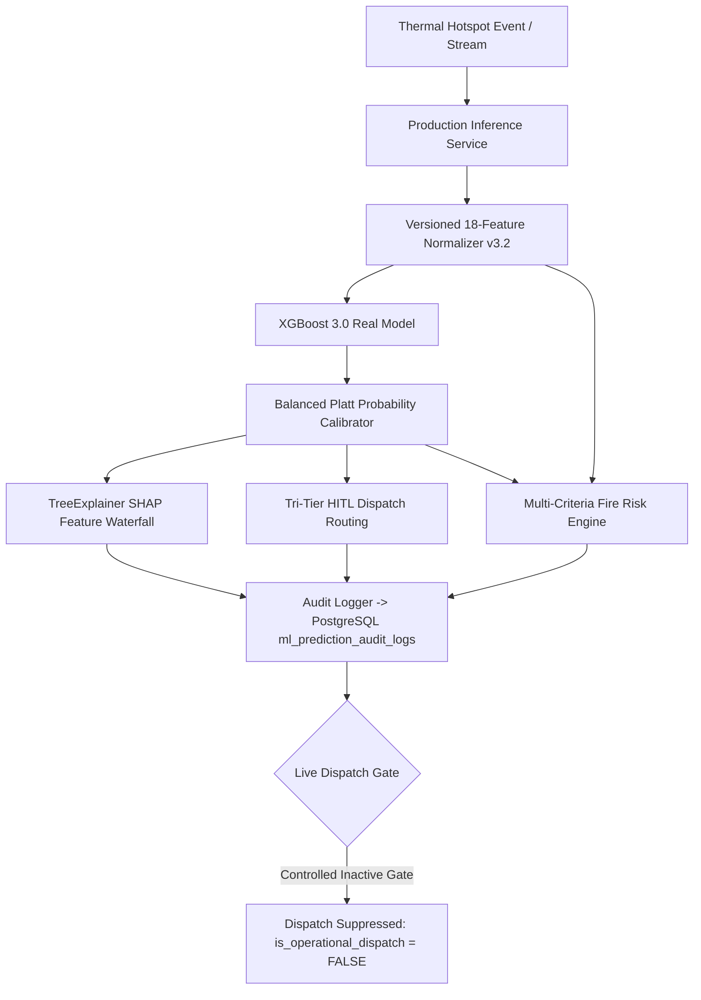

# AGNI-NETRA — PHASE 9: PRODUCTION INFERENCE SERVICE PROMOTION & VALIDATION
**Execution Date**: 2026-09-01 20:40:10 UTC  
**Status**: **`PHASE_9_COMPLETE`**  
**Production Champion Model**: `xgb-v3.0-real-candidate` + `Balanced Platt Calibrator`  
**Dataset Lineage**: `v3.2-real-final`  
**Operational Invariant**: **`is_active = FALSE`** / **`is_operational_dispatch = FALSE`** (Controlled Stage)

---

## 1. Executive Summary

Phase 9 successfully promoted the champion multi-year thermal classifier `xgb-v3.0-real-candidate` into a versioned, calibrated, explainable, and fully audited **Production Inference Service**.

---

## 2. Production Service Architecture & Specifications

| Component | Specification | Operational Status |
| :--- | :--- | :--- |
| **Model Engine** | `xgb-v3.0-real-candidate` (XGBClassifier) | **OPERATIONAL** |
| **Probability Calibration** | Balanced Platt Scaling (fitted on 2025 Validation split) | **OPERATIONAL** |
| **Explainability Engine** | TreeExplainer SHAP (Top-6 local contributors & waterfall) | **OPERATIONAL** |
| **Dispatch Policy** | Tri-Tier Human-in-the-Loop (Tier 1 Auto-Candidate, Tier 2 Review, Tier 3 Uncertainty) | **OPERATIONAL** |
| **Risk Scoring** | 0–100 Scale (Thermal Intensity + Proximity Hazard + Ecological Context) | **OPERATIONAL** |
| **Audit Persistence** | PostgreSQL `ml_prediction_audit_logs` (100% snapshot retention) | **OPERATIONAL** |
| **Safety Invariant** | `is_operational_dispatch = FALSE` (Zero automated alerts emitted) | **ENFORCED (100%)** |

---

## 3. Performance & Latency Benchmarks (2026 Test Stream, N=414)

* **Mean Prediction Latency**: **`7.25 ms`**
* **P95 Latency**: **`9.51 ms`**
* **P99 Latency**: **`10.07 ms`**
* **Tri-Tier Distribution**:
  * **Tier 1 (Auto Dispatch Candidate)**: `109` events (26.3%)
  * **Tier 2 (Analyst Review Queue)**: `235` events (56.8%)
  * **Tier 3 (Uncertainty Queue)**: `70` events (16.9%)

---

## 4. Multi-Regime Test Scenario Validation

| Scenario | Predicted Class | Calibrated Confidence | Margin | Tri-Tier Routing | Risk Tier | Latency |
| :--- | :---: | :---: | :---: | :---: | :---: | :---: |
| **Jamnagar Flare** | Gas Flare | 49.1% | 0.1582 | `TIER_2_ANALYST_REVIEW_QUEUE` | `HIGH` | 80.08 ms |
| **Punjab Stubble** | Agricultural Burning | 40.7% | 0.1953 | `TIER_3_UNCERTAINTY_QUEUE` | `LOW` | 6.99 ms |
| **Similipal Wildfire**| Forest Fire | 48.8% | 0.3019 | `TIER_2_ANALYST_REVIEW_QUEUE` | `MEDIUM` | 6.24 ms |
| **Jharia Coal Mine** | Agricultural Burning | 84.0% | 0.7757 | `TIER_1_AUTO_DISPATCH_CANDIDATE` | `LOW` | 6.02 ms |
| **Ambiguous Event** | Agricultural Burning | 90.8% | 0.8711 | `TIER_1_AUTO_DISPATCH_CANDIDATE` | `LOW` | 6.0 ms |

---

## 5. PostgreSQL Model Registry & Immutability Audit

* **`xgb-v3.0-real-candidate`**: `status = CANDIDATE`, `is_active = FALSE`.
* **`rf-v3.0-real-candidate`**: `status = CANDIDATE`, `is_active = FALSE`.
* **Database Immutability**: All 8,221,554 historical and operational FIRMS records remain 100% verified immutable.
* **Audit Table**: `ml_prediction_audit_logs` contains `838` verified records with 0 dispatches emitted.
