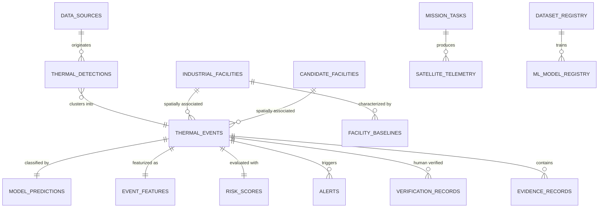

# AGNI-NETRA — Database Entity-Relationship & Schema Specification

## 1. Database Architecture Overview

AGNI-NETRA utilizes a **PostgreSQL 16 + PostGIS 3.4** relational geospatial database with spatial indexing (`GIST` / `R-Tree`) and temporal indexing (`B-Tree`). For standalone local development without external dependencies, a pure-Python fallback database engine operates dynamically.

All primary keys use UUIDs or unique alphanumeric codes.

---

## 2. Table Specifications

### 2.1 Core Entities

1. **`users`**:
   - `id` (UUID, PK)
   - `email` (String, Unique)
   - `hashed_password` (String)
   - `full_name` (String)
   - `role` (Enum: `ADMIN`, `ANALYST`, `AGENCY`, `RESEARCHER`, `INDUSTRY`, `PUBLIC`)
   - `is_active` (Boolean)
   - `created_at`, `updated_at` (DateTime)

2. **`data_sources`**:
   - `id` (UUID, PK)
   - `source_id` (String, Unique: e.g. `NASA_FIRMS`, `OSM_OVERPASS`, `CEA_REGISTRY`)
   - `name` (String)
   - `category` (String)
   - `endpoint` (String)
   - `auth_type` (String)
   - `configured`, `enabled` (Boolean)
   - `health_status` (String: `HEALTHY`, `DEGRADED`, `NOT_CONFIGURED`)
   - `latency_ms` (Float)
   - `record_count` (Integer)
   - `last_success`, `last_failure` (DateTime)

3. **`thermal_detections`**:
   - `id` (UUID, PK)
   - `source` (String: `NASA_FIRMS`, `AGNI_SAT_SIMULATION`, etc.)
   - `sensor` (String: `VIIRS_NOAA21`, `VIIRS_NOAA20`, `MODIS`, `THERMAL_MWIR`)
   - `satellite` (String)
   - `latitude`, `longitude` (Float, Indexed)
   - `acq_timestamp` (DateTime, Indexed)
   - `brightness_k`, `frp_mw` (Float)
   - `confidence` (Float)
   - `day_night` (String: `D`, `N`)
   - `event_id` (UUID, FK -> `thermal_events.id`)

4. **`thermal_events`**:
   - `id` (UUID, PK)
   - `event_code` (String, Unique, Indexed: e.g. `EVT-IN-2026-0801`)
   - `latitude`, `longitude` (Float)
   - `bounding_box` (JSON)
   - `convex_hull_geojson` (JSON)
   - `first_seen`, `last_seen` (DateTime, Indexed)
   - `detection_count` (Integer)
   - `avg_frp`, `max_frp`, `frp_variance` (Float)
   - `avg_brightness` (Float)
   - `state`, `district` (String)
   - `landcover_class` (String: `Industrial`, `Forest`, `Agriculture`, `Urban`, `Mining`, etc.)
   - `facility_id` (UUID, FK -> `industrial_facilities.id`, Nullable)
   - `candidate_facility_id` (UUID, FK -> `candidate_facilities.id`, Nullable)
   - `facility_status` (String: `VERIFIED_FACILITY`, `CANDIDATE_FACILITY`, `UNKNOWN_SOURCE`)
   - `persistence_score` (Float)
   - `status` (String: `ACTIVE`, `CONTAINED`, `UNDER_VERIFICATION`, `RESOLVED`)

5. **`industrial_facilities`**:
   - `id` (UUID, PK)
   - `facility_code` (String, Unique)
   - `name` (String)
   - `industry_type` (String: `Thermal Power`, `Refinery`, `Petrochemical`, `Steel`, `Cement`, etc.)
   - `latitude`, `longitude` (Float)
   - `state`, `district` (String)
   - `capacity` (String)
   - `source` (String: `CEA`, `OSM`, `STATE_POLLUTION_BOARD`)
   - `confidence` (Float)
   - `status` (String: `OPERATIONAL`, `SHUTDOWN`, `UNDER_CONSTRUCTION`)

6. **`candidate_facilities`**:
   - `id` (UUID, PK)
   - `facility_code` (String, Unique)
   - `name_label` (String)
   - `latitude`, `longitude` (Float)
   - `state`, `district` (String)
   - `recurrence_count` (Integer)
   - `first_detected`, `last_detected` (DateTime)
   - `mean_frp`, `max_frp` (Float)
   - `day_night_ratio` (Float)
   - `confidence_score` (Float)
   - `evidence_summary` (String)
   - `status` (String: `DISCOVERED`, `UNDER_REVIEW`, `VERIFIED_PROMOTED`, `REJECTED`)

7. **`facility_baselines`**:
   - `id` (UUID, PK)
   - `facility_id` (UUID, FK -> `industrial_facilities.id`)
   - `mean_frp`, `median_frp`, `std_frp` (Float)
   - `p25_frp`, `p50_frp`, `p75_frp`, `p90_frp`, `p99_frp` (Float)
   - `normal_day_night_ratio` (Float)
   - `observation_count` (Integer)
   - `calculated_at` (DateTime)

8. **`model_predictions`**:
   - `id` (UUID, PK)
   - `event_id` (UUID, FK -> `thermal_events.id`, Unique)
   - `predicted_class` (String: `Industrial Fire`, `Gas Flare`, `Forest Fire`, `Agricultural Burning`, `Mining Activity`, `Other`, `Uncertain`)
   - `confidence` (Float)
   - `class_probabilities` (JSON)
   - `model_name`, `model_version` (String)
   - `shap_values` (JSON)
   - `explanation_summary` (String)
   - `predicted_at` (DateTime)

9. **`risk_scores`**:
   - `id` (UUID, PK)
   - `event_id` (UUID, FK -> `thermal_events.id`, Unique)
   - `risk_score` (Float: 0 - 100)
   - `risk_level` (String: `LOW`, `MODERATE`, `HIGH`, `CRITICAL`)
   - `heat_hazard_subscore` (Float)
   - `abnormality_subscore` (Float)
   - `proximity_subscore` (Float)
   - `environmental_subscore` (Float)
   - `risk_reasons` (JSON)
   - `evaluated_at` (DateTime)

10. **`verification_records`**:
    - `id` (UUID, PK)
    - `event_id` (UUID, FK -> `thermal_events.id`)
    - `user_id` (UUID, FK -> `users.id`)
    - `previous_class` (String)
    - `verified_class` (String)
    - `action` (String: `CONFIRM`, `OVERRIDE`, `REJECT`, `UNCERTAIN`)
    - `notes` (String)
    - `created_at` (DateTime)

11. **`mission_tasks`**:
    - `id` (UUID, PK)
    - `task_code` (String, Unique)
    - `satellite_id` (String: `AGNI-SAT-01`)
    - `target_name` (String)
    - `target_lat`, `target_lon` (Float)
    - `sensor_id` (String: `THERMAL_MWIR`, `OPTICAL_RGB`, `SWIR_2200NM`, `MULTISPECTRAL`)
    - `priority` (String: `LOW`, `NORMAL`, `HIGH`, `CRITICAL`)
    - `scheduled_pass_time` (DateTime)
    - `status` (String: `SIMULATED_TASK_ACCEPTED`, `EXECUTED`, `CANCELLED`)
    - `created_at` (DateTime)

12. **`satellite_telemetry`**:
    - `id` (UUID, PK)
    - `satellite_id` (String)
    - `sensor_id` (String)
    - `subsatellite_lat`, `subsatellite_lon` (Float)
    - `target_lat`, `target_lon` (Float)
    - `measured_frp` (Float)
    - `measured_brightness` (Float)
    - `transmission_status` (String: `RECEIVED`, `PROCESSING`, `PROCESSED`, `FAILED`)
    - `telemetry_timestamp` (DateTime)

---

## 3. Database Indexing Strategy

- **Spatial Indices**: `GIST` indexes on `(latitude, longitude)` across `thermal_detections`, `thermal_events`, `industrial_facilities`, and `candidate_facilities`.
- **Temporal Indices**: `B-Tree` indexes on `acq_timestamp`, `first_seen`, `last_seen`, and `created_at`.
- **Foreign Key Indices**: High-throughput indexed joins on `event_id`, `facility_id`, and `candidate_facility_id`.
