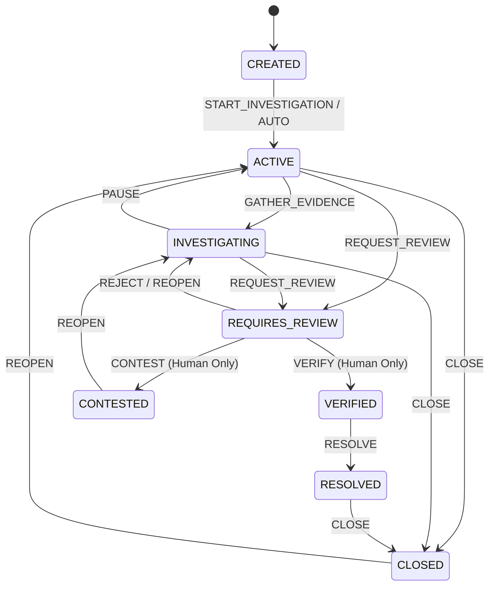
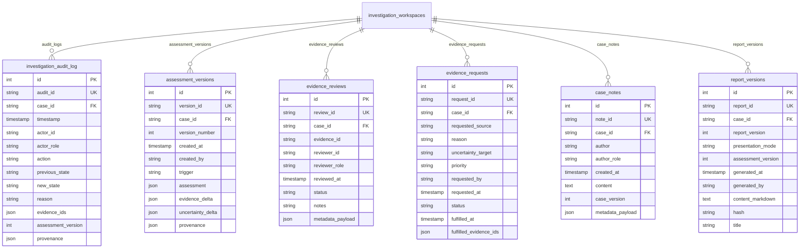

# JARVIS Phase 14: Intelligence Operations, Case Management & Audit Governance

## 1. Executive Summary & Mission
Phase 14 converts the AGNI-NETRA Investigation Workspace and JARVIS intelligence stack into an enterprise-grade, governed, auditable intelligence case-management lifecycle. 

Crucially:
- **No New Predictive Engines:** Phase 14 does NOT alter existing machine learning models, calibrated probabilities, or risk scoring formulas.
- **Operationalizes Existing Intelligence:** Integrates and manages outputs from Phase 7 (Thermal Fusion), Phase 8 (Context Intelligence), Phase 9 (Temporal Intelligence), Phase 10/10.1 (Environmental & Provenance), Phase 11/11.1 (Evidence Graph & Integrity), Phase 12 (Multi-Event Correlation), and Phase 13 (Global Intelligence Synthesis).
- **Enforces Write Safety:** Prevents automated agents from unilaterally closing cases, asserting verification, or altering evidence. JARVIS can only propose governed actions; execution strictly requires authorized human confirmation (`PROPOSE ACTION -> Human APPROVE -> System EXECUTE`).
- **Immutable Audit Trail:** All state changes, actions, and evidence updates are recorded in an append-only audit log with SHA-256 content checksums.

---

## 2. Frozen Baselines & Safety Invariants
The following architectural baselines remain strictly frozen and untouched:
1. **Single Master Agent Invariant:** Exactly one Master JARVIS Agent (`master_orchestrator`). Zero subagents, zero autonomous worker swarms, zero background monitor loops.
2. **Operational Dispatch Gate:** `ENABLE_OPERATIONAL_DISPATCH_GATE = False` remains strictly enforced. Physical actuators, sirens, and automatic field dispatches cannot be triggered.
3. **5-Factor Risk Formula:** Authoritative formula $0.30 \cdot I + 0.25 \cdot A + 0.20 \cdot E + 0.15 \cdot P + 0.10 \cdot C$ is unchanged.
4. **Calibrated ML Models:** XGBoost champion `xgb-v3.0-real-candidate`, Platt calibration, and feature spaces are untouched.
5. **Masking & Privacy:** Masking rules for public disclosure remain active.

---

## 3. Case State Machine & Lifecycle Governance
A case transitions deterministically through well-defined lifecycle states:

### Deterministic State Matrix
| From State | Allowed Target States |
|---|---|
| `CREATED` | `ACTIVE`, `INVESTIGATING` |
| `ACTIVE` | `INVESTIGATING`, `REQUIRES_REVIEW`, `CLOSED` |
| `INVESTIGATING` | `REQUIRES_REVIEW`, `ACTIVE`, `CLOSED` |
| `REQUIRES_REVIEW` | `VERIFIED`, `CONTESTED`, `INVESTIGATING` |
| `VERIFIED` | `RESOLVED`, `INVESTIGATING`, `CLOSED` |
| `CONTESTED` | `INVESTIGATING`, `CLOSED` |
| `RESOLVED` | `CLOSED`, `ACTIVE` |
| `CLOSED` | `ACTIVE` |

Illegal transitions (such as `CREATED` directly to `VERIFIED` or `CLOSED` directly to `RESOLVED`) raise explicit `CaseStateTransitionError` exceptions.

---

## 4. Role-Based Access Control (RBAC) Matrix
Actions are governed by a deterministic role permission matrix:

| Action | ADMIN | ANALYST | AGENCY | RESEARCHER | INDUSTRY | PUBLIC |
|---|:---:|:---:|:---:|:---:|:---:|:---:|
| `START_INVESTIGATION` |  |  |  |  | ❌ | ❌ |
| `UPDATE_ASSESSMENT` |  |  | ❌ | ❌ | ❌ | ❌ |
| `REVIEW_EVIDENCE` |  |  |  | ❌ | ❌ | ❌ |
| `REQUEST_MORE_EVIDENCE` |  |  |  |  | ❌ | ❌ |
| `ADD_ANALYST_NOTE` |  |  |  |  | ❌ | ❌ |
| `REQUEST_REVIEW` |  |  |  | ❌ | ❌ | ❌ |
| `VERIFY` (Human Decision) |  |  | ❌ | ❌ | ❌ | ❌ |
| `CONTEST` (Human Decision) |  |  |  | ❌ |  | ❌ |
| `RESOLVE` |  |  | ❌ | ❌ | ❌ | ❌ |
| `CLOSE` |  |  | ❌ | ❌ | ❌ | ❌ |
| `REOPEN` |  |  |  | ❌ | ❌ | ❌ |
| `PUBLISH_REPORT` |  |  | ❌ | ❌ | ❌ | ❌ |
| `ESCALATE` |  |  |  | ❌ | ❌ | ❌ |

Unauthorized attempts raise `CaseAuthorizationError`.

---

## 5. Write Safety Guard: Propose Before Execute
Autonomous intelligence agents (including JARVIS itself) are strictly prohibited from silently executing state transitions on protected actions (`CLOSE`, `VERIFY`, `CONTEST`, `RESOLVE`, `PUBLISH_REPORT`).

When an autonomous call or unconfirmed command is received:
1. The engine checks if the action is protected.
2. If `confirm_governed_action is False` or `is_autonomous_call is True`:
   - System returns status `"PROPOSED"`.
   - Generates a `CaseActionProposal` containing `proposal_id`, `required_role`, `target_state`, and `confirm_prompt`.
   - Audit trail records `ACTION_PROPOSED`.
   - Case state remains untouched.
3. Once an authorized human analyst confirms (`confirm_governed_action=True`, `is_autonomous_call=False`), the transition executes and logs `ACTION_EXECUTED`.

---

## 6. Database Schema Architecture
Six dedicated, normalized relational tables support Phase 14 governance:

---

## 7. Assessment Versioning & Delta Analysis
Assessments are never silently overwritten. Every synthesis update:
1. Computes delta vs prior version:
   - Added evidence items
   - Removed evidence items
   - Total evidence count
   - Score difference ($\Delta$ score)
   - Uncertainty level shifts (e.g. `UNCERTAIN` $\to$ `PARTIALLY_KNOWN` $\to$ `KNOWN`)
2. Computes SHA-256 hash of the normalized assessment payload.
3. Stores immutable `AssessmentVersion` record with monotonically increasing version number.

---

## 8. Evidence Reviews vs Raw Evidence
Raw empirical observations (VIIRS/MODIS detections, Sentinel-1 backscatter, OSM geometries) are immutable scientific artifacts. Analysts express review judgements in the separate `evidence_reviews` table:
- Review statuses: `ACCEPTED`, `REJECTED`, `DISPUTED`, `UNDER_REVIEW`, `UNVERIFIED`.
- Links to `evidence_id` while leaving the underlying raw record untouched.

---

## 9. Human Verification Decision
Human verification requires:
- Explicit decision: `VERIFIED`, `CONTESTED`, or `REJECTED`.
- Verifier ID: Strictly must be an authorized human user (`actor_id != "JARVIS"`).
- Mandatory rationale/justification text.
- Rejection of autonomous attempts by JARVIS to self-verify.

---

## 10. REST API Specification
Mounted at `/api/v1/investigations`:

| Method | Path | Description |
|---|---|---|
| `GET` | `/{investigation_id}` | Retrieve case details, state, and summaries |
| `GET` | `/{investigation_id}/timeline` | Retrieve synthesized chronological timeline |
| `GET` | `/{investigation_id}/audit` | Retrieve immutable audit trail |
| `GET` | `/{investigation_id}/assessments` | Retrieve assessment version history |
| `GET` | `/{investigation_id}/evidence-reviews` | Retrieve analyst evidence reviews |
| `GET` | `/{investigation_id}/evidence-requests` | Retrieve evidence requests queue |
| `GET` | `/{investigation_id}/reports` | Retrieve versioned intelligence reports |
| `POST` | `/{investigation_id}/actions` | Propose or execute governed case action |
| `POST` | `/{investigation_id}/notes` | Add human analyst note |
| `POST` | `/{investigation_id}/evidence-reviews` | Review and annotate an evidence item |
| `POST` | `/{investigation_id}/evidence-requests` | Request additional sensor/field data |

---

## 11. JARVIS Natural Language Commands
The command interpreter routes Phase 14 natural language commands:

1. **Primary Acceptance Command (Section 23):**
   `"JARVIS, prepare EVT-827 for human verification and show the complete case timeline, assessment history, unresolved evidence requests, latest assessment provenance, and recommended next evidence."`
2. **Assessment Comparison Command (Section 24):**
   `"JARVIS, show me exactly why the assessment changed between the previous and current versions."`
3. **Case Closure Command (Section 25):**
   `"JARVIS, close the investigation."`
4. **Timeline Command:**
   `"JARVIS, show the investigation timeline."`
5. **Assessment History Command:**
   `"JARVIS, show assessment history."`
6. **Unresolved Evidence Requests Command:**
   `"JARVIS, show unresolved evidence requests."`

---

## 12. Frontend UI Integration
Located at `/jarvis`:
- **Case Management Tab:** Real-time state badge, state machine visualizer stepper.
- **Action Controls:** Buttons for Start Investigation, Gather Evidence, Request Review, Verify (Human Only), and Close Case with two-step write confirmation modal.
- **Assessment Version Diff Viewer:** Side-by-side assessment change viewer displaying score deltas and added evidence.
- **Evidence Requests Queue:** Priority-badged table of pending satellite passes or field verifications.
- **Unified Case Timeline:** Interactive chronological feed displaying investigation milestones, sensor detections, reviews, and analyst notes.
