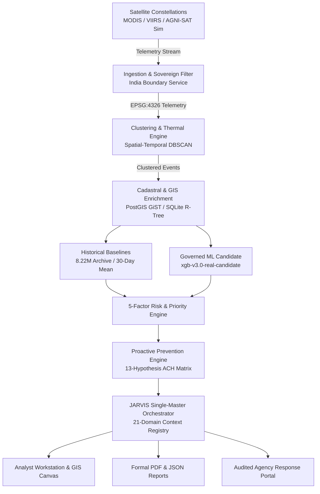

# AGNI-NETRA — Product Requirements Document (PRD)
**System Version:** 2.0.0 (Final Release Freeze)  
**Operating Sovereign Domain:** Republic of India  
**Architecture Model:** Single-Master Governed Orchestrator (JARVIS)  
**Safety Status:** Safety Invariants Permanently Locked (`DISPATCH_GATE=False`, `MODEL_ACTIVATION=False`)

---

## 1. Executive Summary & Vision

### 1.1 Problem Statement
Industrial fires, petrochemical excursions, offshore gas flaring, spontaneous coal combustion, and wildland-urban interface fires across the Indian subcontinent have historically been monitored through fragmented, reactive systems. Existing satellite fire products (e.g. standard FIRMS feeds) lack cadastral facility awareness, fail to distinguish operational industrial flares from uncontrolled catastrophes, lack longitudinal historical context, and produce high false-positive rates for civil protection agencies. Furthermore, ungoverned AI systems risk hallucinatory attribution, unwarranted public alarm, and unauthorized automated dispatch.

### 1.2 Vision
**AGNI-NETRA** (National Geospatial Thermal Intelligence & Industrial Monitoring Platform) is sovereign India's unified thermal surveillance, anomaly classification, and proactive disaster prevention platform. AGNI-NETRA transforms raw satellite thermal radiance detections into verified, cadastral-linked operational intelligence through a single, deterministic intelligence stack governed by human authority.

### 1.3 Core Objectives
1. **Detect**: Ingest multi-sensor thermal observations (MODIS, VIIRS-SNPP, VIIRS-NOAA20/21) within 15 minutes of satellite overpass with sub-second processing.
2. **Understand**: Contextualize anomalies against sovereign administrative boundaries, 35,570 active industrial facilities, 502 CEA power stations (1,633 generating units), IBM mining leases, and 6-year multi-sensor baselines (8.22M detections).
3. **Classify & Assess**: Compute 5-factor mathematical risk and calibrated shadow ML inference with complete SHAP feature attributions without treating probabilistic predictions as ground truth.
4. **Prevent**: Formulate longitudinal root-cause investigations across 13 deterministic hypotheses and synthesize actionable mitigations ("MAY REDUCE RECURRENCE RISK").
5. **Enforce Safety & Governance**: Guarantee zero unauthorized automated dispatch, zero unapproved model promotion, zero external LLMs, and complete audit provenance.

---

## 2. Target Users & Role-Based Access Control (RBAC)

| Role | Target Persona | Permissions & Scope |
| :--- | :--- | :--- |
| **PUBLIC** | Citizens, general researchers, media | Privacy-safe coarse hazard maps, active regional advisories, general safety guidance. Obfuscated coordinates; zero sensitive industrial or regulatory dossiers. |
| **ANALYST** | NDRF duty officers, state disaster analysts, industrial safety inspectors | Full GIS workstation, raw coordinates, 18-part JARVIS World State, event dossiers, SHAP explanations, root-cause hypothesis scoring, draft report compilation. |
| **AGENCY** | GSDMA, PESO, MoEFCC, CPCB, District Collectors | Agency response portal, dispatch recommendation review, verified statutory incident routing, formal report approval, compliance tracking. |
| **ADMIN** | Platform engineers, national system administrators | Ingestion pipeline control, model registry governance, audit log inspection, user provisioning, system health monitoring. |

---

## 3. High-Level System Architecture



---

## 4. The 21 Governed Intelligence Domains (A through U)

JARVIS operates as the **Single Master Intelligence Orchestrator** through a typed, deterministic capability registry across 21 domains. Zero secondary AI models, zero external LLMs, and zero agent swarms exist.

### Domain A: Thermal Observation
- **Input**: Radiometric satellite pixels (MWIR 3.9µm, LWIR 11µm).
- **Outputs**: Fire Radiative Power (FRP in MW), Brightness Temperature (K), detection confidence, day/night flag.
- **Epistemic Status**: `OBSERVED`.
- **Governance Invariant**: Thermal radiance indicates physical radiative heat flux, NOT forensic ground truth.

### Domain B: Ingestion & Pipeline
- **Input**: Multi-provider FIRMS and synthetic telemetry packets.
- **Features**: Deduplication, checkpointing, watermarking, out-of-bounds quarantine, replay protection.
- **Epistemic Status**: `OBSERVED`.

### Domain C: Geographic Intelligence
- **Scope**: Republic of India sovereign polygon boundary (geoBoundaries / Survey of India / LGD 2024).
- **Features**: State, district, subdistrict hierarchy resolution. Foreign coordinates (Pakistan, Sri Lanka, Nepal, maritime waters) are strictly quarantined.
- **Epistemic Status**: `OBSERVED`.

### Domain D: GIS Context & Spatial Layers
- **Layers**: Active hotspots, industrial facilities, thermal density heatmaps, administrative boundaries, Forest Survey of India (FSI) reserves, Bhuvan 50m LULC, CEA power stations, IBM mining blocks.
- **Epistemic Status**: `DERIVED`.

### Domain E: Industrial Intelligence
- **Inventory**: 35,570 active operational facilities (35,684 reference total).
- **Attributes**: Facility name, primary sector, facility type, compliance clearance, cadastral buffer distance.
- **Epistemic Status**: `DERIVED`.

### Domain F: Power Infrastructure Intelligence
- **Inventory**: 502 distinct CEA thermal power stations, 1,633 generating units.
- **Attributes**: Station vs unit distinction, MW capacity, primary boiler type, distance to epicenter.
- **Epistemic Status**: `DERIVED`.

### Domain G: Mining Cadastral Intelligence
- **Inventory**: Indian Bureau of Mines (IBM) auctioned mineral blocks and active mineral leases.
- **Attributes**: Mineral category (coal, lignite, bauxite, iron ore), lease status, cadastral boundary containment.
- **Epistemic Status**: `DERIVED`.

### Domain H: Historical Intelligence & Baselines
- **Archive**: 6-year multi-sensor archive (8.22M observations).
- **Metrics**: 30-day rolling mean FRP, standard deviation, abnormality sigma, annual recurrence rate, persistence score.
- **Governance Rule**: `CORRELATION != CAUSATION`.

### Domain I: Anomaly Intelligence
- **Algorithms**: Isolation Forest radar scoring, multi-dimensional feature z-score outlier evaluation.
- **Epistemic Status**: `DERIVED`.

### Domain J: Machine Learning Intelligence & Governance
- **Candidate Model**: `xgb-v3.0-real-candidate` (status: `CANDIDATE`, `is_active: FALSE`).
- **Production Champion**: `NO_GOVERNED_PRODUCTION_CHAMPION_CONFIGURED`.
- **Artifact SHA-256**: `c52b6369da19d4e423652a3001e38c72737f7f66684e5bc27b9bb1c2a9c754d8`
- **Dataset SHA-256**: `9677c6d65ef8f2ab388160079e868ed2bf17307a9e462e1fba26517ae9bedd0e`
- **Calibration**: Balanced Platt Scaler (`balanced-platt-v3.0`).
- **Explainability**: Warm TreeExplainer local SHAP attributions.
- **Governance Invariant**: Candidate inferences are never presented as ground truth; automated promotion is permanently blocked.
- **Epistemic Status**: `INFERRED`.

### Domain K: Risk Intelligence
- **Governed Formula**:
  $$\text{Risk Score} = 0.30 \times \text{Intensity} + 0.25 \times \text{Proximity} + 0.20 \times \text{Persistence} + 0.15 \times \text{Anomaly} + 0.10 \times \text{Context}$$
- **Tiers**: CRITICAL ($\ge 75$), HIGH ($55-74.9$), MODERATE ($35-54.9$), LOW ($< 35$).
- **Epistemic Status**: `DERIVED`.

### Domain L: Operational Priority
- **Formula**:
  $$\text{Priority Score} = 0.40 \times \text{Risk} + 0.20 \times \text{Confidence} + 0.30 \times \text{Infrastructure} + 0.10 \times \text{Urgency}$$
- **Invariant**: Priority is evaluated and displayed separately from Risk; never merged into an unexplained score.
- **Epistemic Status**: `DERIVED`.

### Domain M: Incident Lifecycle
- **Audited 12 States**:
  `OBSERVED` $\rightarrow$ `VALIDATING` $\rightarrow$ `CONTEXTUALIZING` $\rightarrow$ `ANALYZING` $\rightarrow$ `CLASSIFYING` $\rightarrow$ `ASSESSING` $\rightarrow$ `CORRELATING` $\rightarrow$ `INVESTIGATING` $\rightarrow$ `INTELLIGENCE_READY` $\rightarrow$ `REQUIRES_HUMAN_VERIFICATION` $\rightarrow$ `VERIFIED` / `CONTESTED` $\rightarrow$ `RESOLVED`.
- **Epistemic Status**: `OBSERVED`.

### Domain N: Epistemic Intelligence & Separation
- **Strict 6-Way Partition**:
  - `OBSERVED`: Raw satellite telemetry and physical sensor data.
  - `DERIVED`: Deterministic mathematical, spatial, or cadastral calculations.
  - `INFERRED`: Statistical model inferences and hypothesis likelihoods.
  - `UNKNOWN`: Quantified unknowns due to physical/sensor bounds.
  - `MISSING`: Identified missing telemetry streams.
  - `CONFLICTING`: Contradictory evidence across sensor passes.
- **Invariants**: `INFERRED != OBSERVED`; `MISSING != UNKNOWN`; `MODEL OUTPUT != GROUND TRUTH`.

### Domain O: Human Verification
- **Principle**: AI assists; evidence informs; human verification decides.
- **Ground Truth**: Tier-1 human analyst inspection verdict is authoritative and immutable once logged.
- **Epistemic Status**: `OBSERVED`.

### Domain P: Prevention Intelligence
- **Structure**: Prevention Case $\rightarrow$ Root Cause Hypotheses $\rightarrow$ Evidence Graph $\rightarrow$ Recommendations $\rightarrow$ Authority Routing $\rightarrow$ Formal Dossier.
- **Epistemic Status**: `DERIVED`.

### Domain Q: Deterministic Root-Cause Intelligence
- **Analysis of Competing Hypotheses (ACH)**: 13 deterministic hypotheses evaluated against supporting/contradicting evidence:
  1. Industrial Process Excursion
  2. Flammable Vapor Cloud
  3. Liquid Hydrocarbon Spill
  4. Equipment Integrity Loss
  5. Storage Tank Rim Seal Ignition
  6. Chemical Reaction Runaway
  7. Electrical Transformer Fault
  8. Human Scrap Burning
  9. Weather / Lightning Event
  10. Wildfire / Forest Canopy (contradicted in urban/industrial zones)
  11. Agricultural Residue Burning (contradicted in industrial cadastre)
  12. Coal Mining Overburden Fire (contradicted in non-mining zones)
  13. Complex Uncharacterized Factor
- **Epistemic Status**: `INFERRED`.

### Domain R: Actionable Prevention Recommendations
- **Catalog**: 6 evidence-linked risk mitigations (e.g. FGRU surge optimization, fence-line OGI deployment, rim seal deluge inspection).
- **Mandatory Disclaimers**: "THESE MEASURES MAY REDUCE RECURRENCE RISK; ZERO PREVENTION GUARANTEE IS CLAIMED."
- **Epistemic Status**: `DERIVED`.

### Domain S: Governed Reporting & Export
- **Formats**: Formal 24-Section ReportLab PDF Dossier and cryptographic SHA-256 JSON export.
- **Governance Gate**: `DRAFT` $\rightarrow$ `REVIEW` $\rightarrow$ `HUMAN APPROVAL` $\rightarrow$ `SEND`. JARVIS cannot independently transmit reports.

### Domain T: Authority Intelligence
- **Jurisdiction Mapping**: Central (PESO, NDRF), State (GSDMA, SDMA, SPCB), District (DEOC, Collectorate), Operator (Facility HSE Directorate).
- **Invariant**: Zero hallucinated contacts or email addresses.

### Domain U: AGNI-SAT Virtual Satellite Digital Twin
- **Nature**: Deterministic orbital simulator and digital twin running through the exact same 10-stage processing pipeline.
- **Scenarios**: 12 standardized executable scenarios with actual stage latency benchmarking.
- **Invariant**: All simulation outputs explicitly disclose `SIMULATED`.

---

## 5. Security & Safety Gates

```
+-------------------------------------------------------------+
|              PERMANENT HARDWARE/CODE SAFETY LOCKS           |
|                                                             |
|   ENABLE_OPERATIONAL_DISPATCH_GATE = False                  |
|   ENABLE_AUTOMATED_MODEL_ACTIVATION = False                 |
|                                                             |
|   - Zero automated emergency dispatch                       |
|   - Zero unapproved candidate model promotion               |
|   - Zero secondary LLMs / AI agents / Swarms                |
|   - Strict sovereign boundary containment (India EPSG:4326) |
+-------------------------------------------------------------+
```

---

## 6. Authoritative Data Semantics Baseline

| Metric / Entity | Governed Invariant Count | Lineage / Source |
| :--- | :--- | :--- |
| **Active Operational Facilities** | **35,570** | Authoritative industrial cadastre (`industrial_facilities`) |
| **Staging Variance** | **114** | Temporary buffer staging records (`staging_variance`) |
| **Historical Reference Facilities** | **35,684** | Total facility registry baseline (`35,570 + 114`) |
| **CEA Power Stations** | **502** | Central Electricity Authority registered power projects |
| **CEA Generating Units** | **1,633** | Individual turbine/boiler generating units across 502 stations |
| **Operational Clustered Events** | **88** | Active clustered events in database |
| **Active Monitoring Incidents** | **82** | Ongoing operational thermal clusters |
| **Verified Incidents** | **6** | Human ground-truth verified historical incidents |
| **Operational Alerts** | **88** | Active alerts in routing queue |
| **Evaluation Benchmark Records** | **264** | Governed benchmark evaluation dataset rows |
| **Historical Detection Archive** | **8.22 Million** | 6-year multi-sensor partitioned thermal detection archive |

---

## 7. Acceptance Criteria & Quality Gates

1. **Zero Uncaught Exceptions**: Browser console clean of hydration mismatches, maximum update depth loops, and React key warnings.
2. **Deterministic Response Time**:
   - Boundary containment query: $< 1.0\text{ ms}$ warm ($< 0.3\text{ s}$ cold).
   - JARVIS world-state assembly: $< 50\text{ ms}$.
   - 18 Golden Questions: $< 15\text{ ms}$ per query from database state.
   - AGNI-SAT scenario execution: $< 5\text{ s}$ total throughput.
3. **Map / GIS Visual Excellence**:
   - MapLibre GL initializes cleanly in Web Mercator with WebGL acceleration.
   - `renderWorldCopies: false` enforced.
   - Basemap fallback displays graceful dark grid with sovereign boundary and event markers if remote tiles fail.
4. **Governed Intelligence Grounding**:
   - 100% of responses cite real database records. Zero placeholder or fabricated records.
   - Epistemic separation (OBSERVED, DERIVED, INFERRED, UNKNOWN, MISSING) explicitly rendered.
