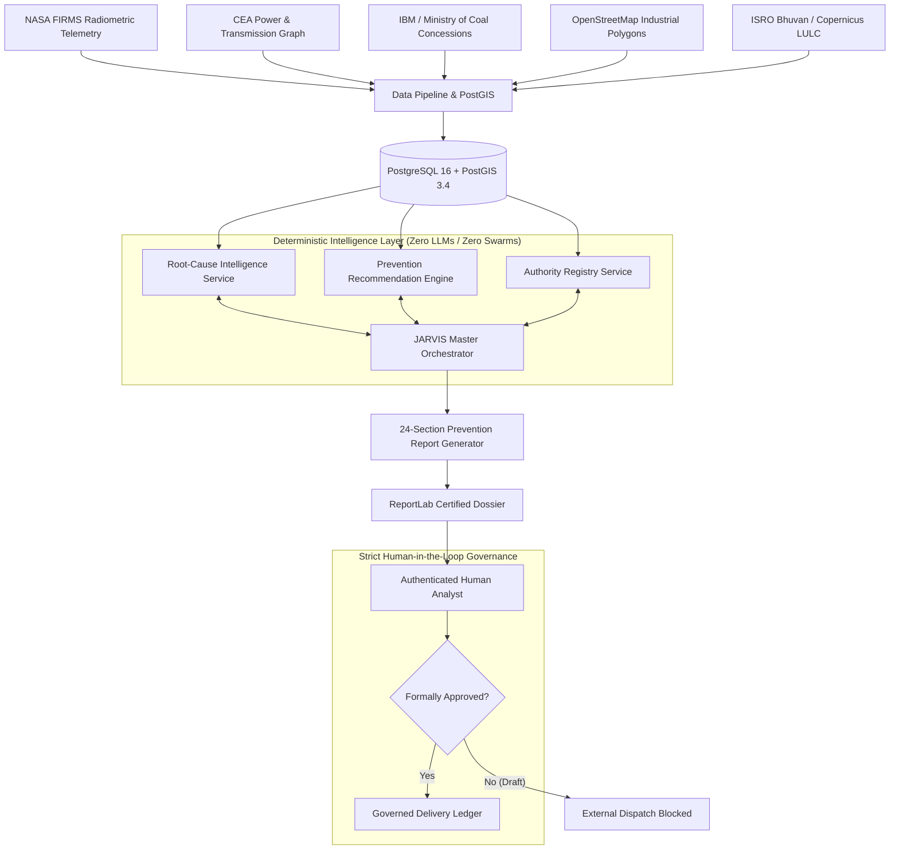

# AGNI-NETRA — Proactive Fire Prevention & Root-Cause Intelligence Architecture
**Branch**: `feature/proactive-fire-prevention`  
**Standard**: Indian Geopolitical, Industrial & Regulatory Context (Level 2 Boundary Verification)  
**Safety Status**: Autonomous Dispatch Prohibited (`ENABLE_OPERATIONAL_DISPATCH_GATE = False`)  
**Reasoning Layer**: JARVIS Single-Master Orchestrator (Zero Generative LLMs / Zero Swarms)

---

## 1. Executive Mission & Architectural Shift

The AGNI-NETRA platform was initially engineered to execute near-real-time tactical response:
```
DETECT → CLASSIFY → ASSESS RISK → PRIORITIZE → VERIFY
```
While essential for immediate containment, tactical workflows do not answer the strategic question:
> **"Why is this location experiencing repeated fires, and what specific physical or operational interventions will prevent recurrence?"**

The Proactive Fire Prevention Extension extends the architecture into a longitudinal preventive lifecycle:
```
DETECT 
  → ANALYZE HISTORY (Multi-Year Recurrence & Persistence)
  → CORRELATE EVIDENCE (Spatial Boundaries, Infrastructure, Land-Use)
  → IDENTIFY CONTRIBUTING FACTORS (Atmospheric, Operational, Fuel Drift)
  → DETERMINE ROOT-CAUSE HYPOTHESES (13 Deterministic Physical Categories)
  → RECOMMEND PREVENTIVE ACTION (Targeted Engineering & Regulatory Controls)
  → HUMAN REVIEW (Mandatory Analyst Verification Gate)
  → GENERATE REPORT (24-Section Certified Formal Dossier)
  → HUMAN-APPROVED DELIVERY (Cryptographic Delivery Ledger with SHA-256 Hash)
```

---

## 2. Core Architectural Principles & Invariants



### Invariant 1: Single Master Orchestrator (Zero LLMs / Swarms)
- No generative chatbots, LLM calls, or uncontrolled agent swarms are permitted.
- JARVIS is the single deterministic reasoning orchestrator. All capabilities and hypotheses are backed by deterministic code, transparent mathematical scoring formulas, and verified PostGIS spatial boundaries.

### Invariant 2: Epistemic Anti-Fabrication Guarantees
- If telemetry or datasets are unavailable, the system prints explicit standardized disclosures:
  - Missing gas telemetry: `"GAS COMPOSITION DATA UNAVAILABLE"`
  - Missing news coverage: `"NEWS EVIDENCE UNAVAILABLE"`
  - Missing agency investigations: `"No verified agency records available"`
- Every dossier, dashboard, and case record prominently displays:
  - `"HISTORICAL CORRELATION DOES NOT IMPLY CAUSATION."`
- Every recommendation is mathematically framed:
  - Statements must declare that interventions `"MAY REDUCE RECURRENCE RISK"` (never guarantee prevention).

### Invariant 3: Autonomous Dispatch Gate
- `ENABLE_OPERATIONAL_DISPATCH_GATE = False` is hardcoded.
- Automated generation of draft dossiers is allowed, but external transmission strictly requires:
  1. An authenticated human user session.
  2. Role of `ANALYST` or `ADMIN`.
  3. Immutable cryptographic recording in `ReportDeliveryAudit` with SHA-256 payload integrity hashing.

### Invariant 4: Decoupled Prevention Priority vs Real-Time Operational Risk
- Real-time `RiskScore` measures current thermal intensity, spread speed, and acute exposure.
- `PreventionPriority` (`CRITICAL`, `HIGH`, `MODERATE`, `LOW`) measures longitudinal recurrence, multi-year baseline deviation, persistent equipment footprint overlap, and recurring root-cause risk.

---

## 3. Component Architecture & Directory Structure

```
backend/app/
├── models/
│   ├── domain.py                      # PreventionCase, RootCauseHypothesisRecord, 
│   │                                  # PreventionRecommendationRecord, AuthorityDirectoryRecord,
│   │                                  # PreventionReportRecord, ReportDeliveryAudit
│   └── schemas.py                     # Pydantic schemas for request/response validation
├── services/
│   ├── intelligence/
│   │   ├── root_cause_intelligence_service.py     # 13 hypothesis evaluators, transparent scoring
│   │   ├── prevention_recommendation_engine.py    # Evidence-linked mitigation actions
│   │   └── authority_registry_service.py          # Spatial jurisdiction matching
│   ├── prevention_report_generator.py             # 24-section compiler & ReportLab PDF generator
│   └── jarvis/
│       ├── jarvis_tools.py                        # Root-cause & prevention tool implementations
│       ├── jarvis_capability_registry.py          # Capability registration & dispatch
│       └── jarvis_world_state.py                  # In-memory unified state synthesis
└── api/v1/endpoints/
    └── prevention.py                              # REST API endpoints for cases, reports, approval, delivery

frontend/src/app/dashboard/prevention/
├── page.tsx                                       # Prevention Dashboard (KPIs, filter, case registry)
└── [id]/page.tsx                                  # Case Detail Workspace (13 Hypotheses, Evidence Matrix, 
                                                   # Recommendations, Authorities, Report Governance)
```

---

## 4. End-to-End Workflow

1. **Detection & Context Discovery**: An active or historical thermal event (`EVT-...`) is retrieved from PostgreSQL/PostGIS.
2. **Longitudinal Analysis**: The system analyzes FIRMS observations within 1.5 km over a 3–5 year window, computing recurrence frequency (events/year), persistence index, and baseline FRP deviation ratio.
3. **Hypothesis Evaluation**: The 13 root-cause evaluators process the event's telemetry, landcover, industrial sector, distance to infrastructure, and baseline deviations to generate scored hypotheses (`0.00` to `1.00`).
4. **Action Generation**: The recommendation engine maps plausible hypotheses and industrial contexts to targeted preventive actions with regulatory urgency badges.
5. **Authority Resolution**: The authority registry queries jurisdictional databases (national, state, district, and facility HSE) matching the event's administrative boundary.
6. **Case Persistence**: All artifacts are stored in `prevention_cases`, `root_cause_hypotheses`, and `prevention_recommendations`.
7. **Report Compilation**: On demand, the 24-section formal report is compiled into JSON and an authoritative PDF is generated with ReportLab.
8. **Human Review & Approval**: An authorized analyst reviews the case, attaches notes, and promotes the report status from `DRAFT` to `APPROVED`.
9. **Governed Dispatch**: The approved report is transmitted to the designated agency, generating an immutable SHA-256 audit entry.
