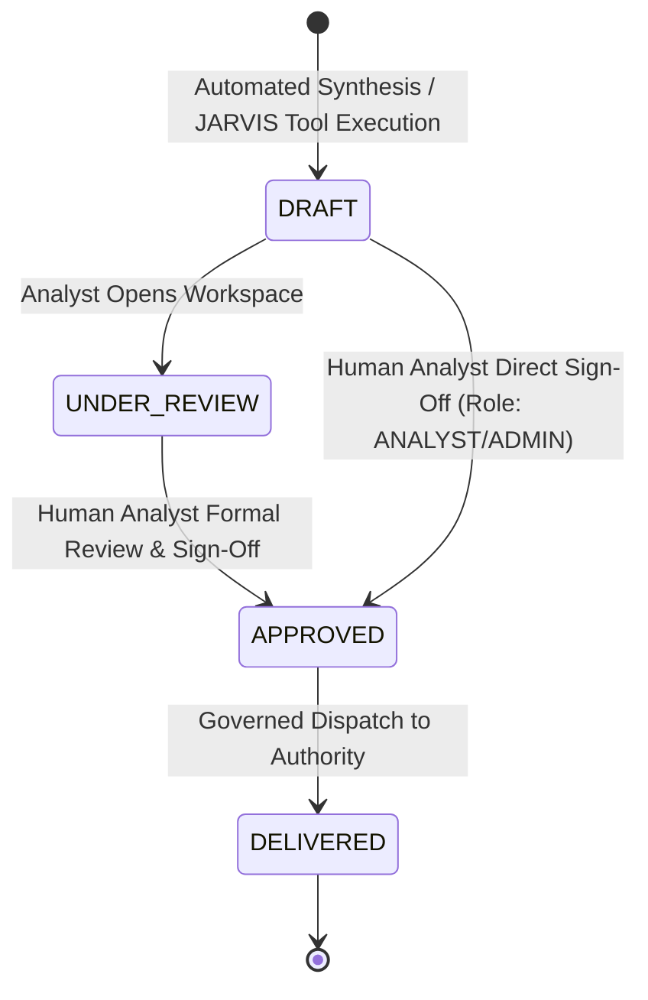

# AGNI-NETRA — 24-Section Prevention Intelligence Report Schema & Lifecycle
**Document Standard**: Formal Government & Industrial Multi-Agency Dossier  
**Rendering Engines**: JSON Schema V1 / ReportLab 3.6+ Flowable PDF  
**Implementation**: `backend/app/services/prevention_report_generator.py`  
**Governance Lifecycle**: `DRAFT → UNDER_REVIEW → APPROVED → DELIVERED`

---

## 1. 24-Section Canonical Dossier Architecture

The Prevention Intelligence Dossier compiles 24 structured sections combining multi-source spatial telemetry, multi-year statistical baselines, deterministic root causes, and regulatory recommendations:

| Section # | Section Title | Description / Contents |
|---|---|---|
| **1** | **Executive Summary** | High-level synthesis, Prevention Priority level, Evidence Strength, Core Epistemic Disclaimer |
| **2** | **Incident Overview** | Target event code, case number, status, observed timestamp, investigating authority |
| **3** | **Location & Geography** | Coordinates (lat/lon), state, district, subdistrict, Survey of India L2 boundary |
| **4** | **Thermal Observation** | Peak FRP (MW), average FRP (MW), detection count, VIIRS/MODIS sensor provenance |
| **5** | **Historical Incident Pattern** | Annual recurrence rate (episodes/yr), persistence index, baseline FRP, multi-year trend |
| **6** | **Recurrence Analysis** | Recurrence classification (Persistent Recurrent Hotspot vs Episodic), correlation warning |
| **7** | **Spatial Correlation** | Proximity to industrial infrastructure, boundary containment, coordinates |
| **8** | **Industrial Context** | Facility name, sector, operational scale, regulatory classification |
| **9** | **Environmental Context** | LULC class, proximity to water bodies, vegetative indices, terrain context |
| **10** | **Material & Substance Context** | Suspected materials, storage type, chemical class (*"GAS COMPOSITION DATA UNAVAILABLE"*) |
| **11** | **Agency Evidence** | Official records (*"No verified agency records available"*) |
| **12** | **External Evidence** | Web/media records (*"NEWS EVIDENCE UNAVAILABLE"*) |
| **13** | **ML Classification** | Model prediction (predicted class, confidence %, XGBoost provenance, SHAP attribution) |
| **14** | **Anomaly Analysis** | Baseline deviation ratio, intensity anomaly classification, narrative anomaly explanation |
| **15** | **Risk Assessment** | Operational risk score, risk level, decoupled prevention priority comparison |
| **16** | **Root-Cause Hypotheses** | Ranked 13-category hypotheses with confidence, status, caveats, and physical descriptions |
| **17** | **Supporting Evidence** | Synthesized table of observed physical indicators backing primary hypotheses |
| **18** | **Contradicting Evidence** | Contradicting indicators and absent factors explaining why alternative hypotheses were ruled out |
| **19** | **Missing & Unknown Information** | Explicit listing of missing variables, unintegrated telemetry, and unknown components |
| **20** | **Preventive Recommendations** | Actionable engineering and inspection controls with urgency, authority, and safety phrasing |
| **21** | **Responsible Authorities** | Matched jurisdictional authorities (Disaster management, fire brigade, pollution control, factory inspectorate) |
| **22** | **Human Verification Status** | Verification state, human review requirement, analyst attribution, review notes |
| **23** | **Data Provenance & Lineage** | Explicit sensor sources, processing algorithms, and telemetry confidence tiers |
| **24** | **Audit Trail & Cryptographic Verification** | Compilation timestamp, compiler signature, SHA-256 integrity hash, delivery ledger reference |

---

## 2. Governed Lifecycle State Machine



### State Definitions & Enforced Invariants:
1. **`DRAFT`**:
   - Report generated by automated intelligence or JARVIS tool.
   - External dispatch is strictly blocked. Attempting to deliver raises `ValueError: Cannot deliver report in 'DRAFT' state.`
2. **`UNDER_REVIEW`**:
   - Assigned to an analyst for review. Notes and telemetry cross-checks recorded.
3. **`APPROVED`**:
   - Approved by an authenticated user with role `ANALYST`, `ADMIN`, or `AGENCY`.
   - Records approver name, timestamp, and review notes.
4. **`DELIVERED`**:
   - Formally dispatched to a verified jurisdictional authority via secure portal, government email, or official dispatch API.
   - An immutable `ReportDeliveryAudit` record is created with a SHA-256 cryptographic payload hash.

---

## 3. Cryptographic Ledger & Audit Schema

When a report is delivered, the system records:
```json
{
  "id": "uuid4",
  "report_id": "REP-GUJ-20260919-6DD8AB",
  "recipient_name": "Chief Fire Officer",
  "recipient_organization": "Jamnagar Municipal Corporation Fire Brigade",
  "recipient_role": "Chief Fire Officer",
  "delivery_channel": "SECURE_GOV_DISPATCH",
  "dispatched_by_user_id": "USR-ANL-01",
  "dispatched_by_user_email": "lead.analyst@agni-netra.gov.in",
  "dispatched_by_user_role": "ANALYST",
  "delivery_status": "SENT",
  "delivery_timestamp": "2026-09-19T21:33:55Z",
  "audit_hash": "20459c142309d3dceb77a066914589d891630bb399719ea54a559d1ef50eec37"
}
```
The `audit_hash` is computed as:
$$\text{SHA256}(\text{report\_id} + \text{recipient\_name} + \text{dispatched\_by\_email} + \text{delivery\_timestamp})$$
